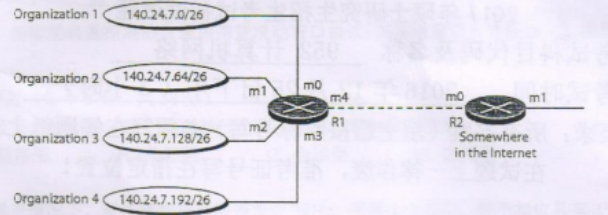
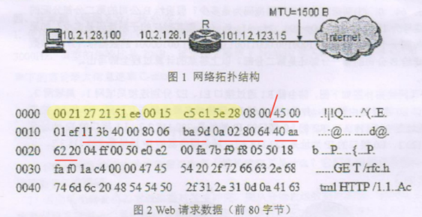
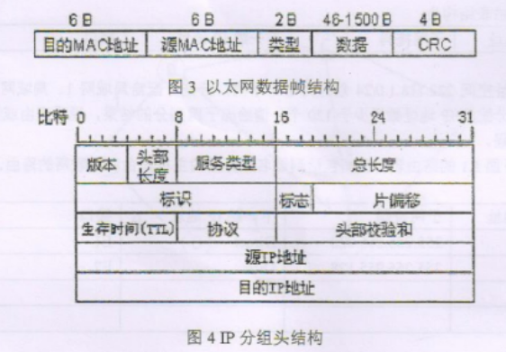

## 填空（1/22）

1.采用虚电路交换方式的分组交换网络有 X25、（）和ATM

2.IEEE 802.11 定义了两个 MAC 功能子层: （）和点协调功能子层

3.典型的三种传输损伤包括（）、失真和噪声

4.ARP 请求报文是广播发送，ARP 回答报文是（）发送。

5.数字信号 T1 线路采用时分多路复用技术传输多路模拟语言信号,其为 193 位，每一顿的持续时间为 1/8000 秒，总数据速率为（）bps

6.为了保证检测所有情况下最多 s 个错误，块编码中最小汉明距离应为（）

7.设 m 是以位为单位的序列号字段长度，在回退 N 顿自动重发请求协议中，发送窗口的大小必须小于（），在选择性重复自动重发请求协议中，发送窗口的大小最多是（）

8.一个16 端口的以太网二层交换机，有（）个冲突域和2个广播域

9.某小型公司分配了一个由 15 个地址组成的地址块，其起始地址是 205.16.37.33，最后一个地址是 205.16.37.47，则这个地址块的网络地址是（）(用变长掩码表示)

10.IPv6 地址 0000:A015:0000:0000:0000:0001:0012:1213 的缩短形式是（）

11.ICMP 协议的功能是为弥补（）协议没有差错报告或者差错纠正机制和查询主机或路由器状态的缺点，其报文被封装在（）协议的报文中传送，常用的（）程序(命令)就是利用 ICMP 的回送报文来确定目的主机是否正常工作

12.传输层的套接字地址由（）和端口号组成

13.同一时刻双方均能发送和接收数据的信道通信方式被称为（）

14.计算机网络协议的三要素分别是（）、语义和时序

15.电子邮件的发送协议是（），电子邮件的接收协议有 POP3 和 IMAP

17.OSI 参考模型中，数据链路层提供 之间的差错控制和流控，而传输层的差错控制和流控是在（）之间

18.传输层流量控制协议采用信贷滑动窗口协议，其发送窗口尺寸是由（）决定的

## 选择（2/38）

1.在 OSI 参考模型中，自下而上第一个提供端到端服务的层次是（）

- A.数据链路层
- B.传输层
- C.会话层
- D.应用层

2.在无噪声情况下，若某通信链路的带宽为 3kHz，采用 4 个相位，每个相位具有 4 种振幅的 QAM 调制技术，则该通信链路的最大数据传输速率是（）

- A.12kbps
- B.24kbps
- C.48kbps
- D.96kbos

3.HDLC 协议的管理 (或监控) 中提供的差错控制机制是 （）

- A.后退N帧 + 选择重发
- B.后退N帧 + 停等协议
- C.停等协议 + 选择重发
- D.后退N帧 + 选择重发 + 停等协议

4.数据链路层采用了后退N(GBN)协议，发送方已经发送了编号为 0~7 的。当计时器超时时，若发送方只能 0、2、3 号的确认，则发送方需要重新发的顿数是（）

- A.2
- B.3
- C.4
- D.5

5.在局域网中划分 VLAN，不同 VLAN 之间必须通过（）连接才能互相通信

- A.中继端口
- B.动态端口
- C.接入端口
- D.静态端口

6.关于交换机，下面说法中错误的是（）

- A.以太网交换机根据 MAC 地址进行交换
- B.帧中继交换机根据虚电路号 DLCI 进行交换
- C.三层交换机根据网络层地址进行转发，并根据 MAC 地址进行交换
- D.ATM 交换机根据虚电路标识和 MAC 地址进行交换

7.关于路由器，下列说法中正确的是（）

- A.路由器处理的信息量比交换机少，因而转发速度比交换机快
- B.对于同一目标，路由器只提供延迟最小的最佳路由
- C.通常的路由器可以支持多种网络层协议，并提供不同协议之间的分组转换
- D.路由器不但能够根据逻辑地址进行转发，而且可以根据物理地址进行转发

8.访问交换机的方式有多种，配置一台新的交换机时可以通过（）进行访问

- A.通过微机的串口连接交换机的控制台端口
- B.通过 Telnet 程序远程访问交换机
- C.通过浏览器访问指定 IP 地址的交换机
- D.通过运行 SNMP 协议的网管软件访问交换机

9.主机甲通过1个路由器(存储转发方式)与主机乙互联，两段链路的数据传输速率均为 10Mbps，主机甲分别采用报文交换和分组大小为 10kb 的分组交换向主机乙发送1个大小为 8Mb(1M=106)的报文。若忽略链路传播延迟、分组头开销和分组拆装时间，则两种交换方式完成该报文传输所需的总时间分别为 （）

- A.800ms、1600ms
- B.801ms、1600ms
- C.1600ms、800ms
- D.1600ms、801ms

10.标准以太网使用的介质访问方法是（）

- A.1-持续的 CSMA 方法
- B.1-持续的 CSMA/CD 方法
- C.非持续的 CSMA/CD 方法
- D.p-持续的 CSMA 方法

11.开放最短路径优先协议(OSPF)采用（）算法计算最佳路由

- A.Dynamic-Search
- B.Bellman-Ford
- C.Dijkstra
- D.Spanning-Tree

12.在 RIP 协议中，可以采用水平分割法(Split Horizon)解央路由环路问题，下面的说法中正确的是（）

- A.把网络分制成不同的区域以减少路由循环
- B.不要把从一个邻居学习到的路由再发送回该邻居
- C.设置邻居之间的路由度量为无限大
- D.路由器必须把整个路由表发送给自己的邻居

13.如果用户网络需要划分成 5 个子网，每个子网最多 25 台主机，则适用的子网掩码是（）

- A.255.255.255.192
- B.255.255.255.248
- C.255.255.255.240
- D.255.255.255.224

14.在TCP/IP 体系结构中，直接为 ICMP 提供服务的协议是 （）

- A.PPP
- B.IP
- D.TCP
- C.UDP

15.如下图所示的网络配置中，4 个组织结构的地址块被汇聚为一个较大的地址块，图中路由器 R2 的 m0 接口的网络地址是（）

- A.140.24.7.0/24
- B.140.24.7.64/24
- C.140.24.7.128/24
- D.140.24.7.192/24

16.网络层、数据链路层和物理层传输的数据单位分别是

- A.报文、顿、比特
- B.分组、报文、比特
- C.分组、帧、比特
- D.数据块、分组、比特

17.下列网络设备中，能够抑制广播风暴的是

Ⅰ.中继器	Ⅱ.集线器	Ⅲ.网桥	IV.路由器

- A.仅Ⅰ和Ⅱ
- B.仅Ⅲ
- C.仅Ⅲ和IV
- D.仅IV

18.使用浏览器访问某大学 Web 网站主页时，不可能使用的协议是（）

- A.PPP
- B.ARP
- C.UDP
- D.SMTP

19.主机甲向主机乙发送一个(SYN=1，seq=11220)的 TCP 段，期望与机乙建立 TCP连接，若主机乙接受该连接请求，则主机乙向主机甲发送的正确的 TCP 段可能是（）

- A.(SYN=0，ACK=0，seq=11221，ack=11221)
- B.(SYN-1，ACK=1，seq=11220，ack=11220)
- C.(SYN=1，ACK=1，seq=11221，ack=11221)
- D.(SYN=0，ACK=0，seq=11220，ack=11220)

## 简答（6/30）

1.互联网中，从主机的浏览器到服务器的 Web 服务之间，在几级地址寻址？这些寻址机制分别是什么？为什么需要多级寻址？

2.在 OSI 的 7 层网络模型中,哪层存在流量控制？这些流量控制的原理分别是什么？为什么要在多个"层"均进行流量控制？

3.简述 TCP 拥塞控制中的慢启动和拥塞避免的原理，并画出示意图，阈值为 16

4.简述当前典型的 Web 邮箱登录都采用了哪些安全机制? 并简述传输层安全机制原理

5.简述DNS 两种工作模式的原理

## 计算（8/40）

1.使用每个信号元素 8 个电平级的传输方案在 PSTN 传输数据。如果 PSTN 的带宽是 3000Hz，信噪比是 20dB，试求出无噪声下 Nyquist 最大数据传输速率 C，和有噪声下的理论最大信息速率 C-max

2.某局域网采用 CSMA/CD 协议实现介质访问控制，数据传输速率为 10MBPS,主机甲和主机乙之间的距离为 2KM，信号传播速度是 200000KMS.请回答下列问题，并给出计算过程

- (1) CSMA/CD 协议中的冲突窗口和最小长度的定义是什么? 它们之间的关系是什么？请用数学公式解答
- (2) 若主机甲和主机乙发送数据时发生冲突，则从开始发送数据时刻起，到两台主机均检测到冲突时刻止，最短需经多长时间？最长需经过多长时间？(假设主机甲和主机乙发送数据过程中，其他主机不发送数据)
- (3) 若网络不存在任何冲突与差错，主机甲总是以标准的最长以大网数据锁(1518 字节)向主机乙发送数据，主机乙每成功收到一个数据锁后，立即发送下一个数据锁，此时主机甲的有效数据传输速率是多少？(不考虑以大网的前导码)

3.按照下图给出的拓扑结构，使用 Dikstra 算法求结点 A 到结点 F 的最小费用路径，并给出以 A 为顶点的最小代价通路树

4.采用可变长子网掩码技术可把大网络分成小子网。假设 A 公司需要把子网掩码为 255.255.0.0 的网络 40.15.0.0 分为两个子网，假设第一个子网为 40.15.0.0/17，则

- (1) 第二个子网的网络号和子网掩码是多少？假设另外一个 B 司有 2个分部，第一分部有 2000 台主机
- (2) 则至少应给其分配多少个 C 类网络？如果分配给第一分部的网络号为 196.25.64.0
- (3) 则指定给其的子网掩码为是多少？假设给 B 公司的第二分部分配的 C 类网络号为 196.25.16.0~196.25.31.0
- (4) 则其对应的子网掩码是多少? 如果路由器收到一个目标地址为 11000100.00011001.01000011.00100001 的数据报
- (5) 则该数据报应送给 B 公司的第一分部还是第二分部? 

以上答案的计算过程全部写出

5.某公司网络拓扑图如下图，路由器 R1 通过接口 E1、E2 分别连接局域网 1、局域网 2 通过接口 L0 连接路由器 R2，并通过路由器 R2 连接域名服务器与互联网。R1的 L0 接口的 IP 地址是 222.118.2.1，R2的 L0 接口的地址是 222.118.2.2，L1接口的 IP 地址是 130.11.120.1，E0 接口的 IP 地址是 222.118.3.1，城名服务器的 IP 地址是 222.118.3.2

- (1) 将 IP 地址空间 222.118.1.0/24 划分为 2 个子网，分别分配给局域网 1、局域网 2，每个局域网需分配的 IP 地址数不少于 120 个。请给出子网划分的结果，说明理由或给出必要的计算过程
- (2) 请完善下面 R1 的路由表，便其包括到域名服务器的主机路由和互联网的路由 R1 路由表

| 目的网络IP地址 | 子网掩码        | 下一跳IP地址 | 接口 |
| -------------- | --------------- | ------------ | ---- |
| 222.118.1.0    | 225.225.225.128 | Direct       | E1   |
| 222.118.1.128  | 225.225.225.128 | Direct       | E2   |
|                |                 |              |      |
|                |                 |              |      |

## 综合（20）

某主机的 MAC 地址为 00-15-C5-C1-5E-28，IP 地址为 10.2.128.100(私有地址)。图1是网络拓扑，图 2 是该主机进行 Web 请求的 1 个以太网数据前 80 个字节的十六进制及 ASCII 码内容

请参考图中的数据回答以下问题

- (1) Web 服务器的 IP 地址是什么?该主机的默认网关的 MAC 地址是什么？
- (2) 该主机在构造图 2 的数据时，使用什么协议确定目的 MAC 地址？封装该协议请求报文的以太网顿的目的 MAC 地址是什么？
- (3) 假设 HTTP/1.1 协议以持续的非流水线方式工作,一次请求-响应时间为 RTT，rfc.html 页面引用了 5 个JPEG 小图像，则从发出图 2 中的 Web 请求开始到浏览器收到全部内容为止，需要多少个 RTT？
- (4) 该所封装的 IP 分组经过路由器 R 转发时，需修改 IP 分组头中的哪些字段？

