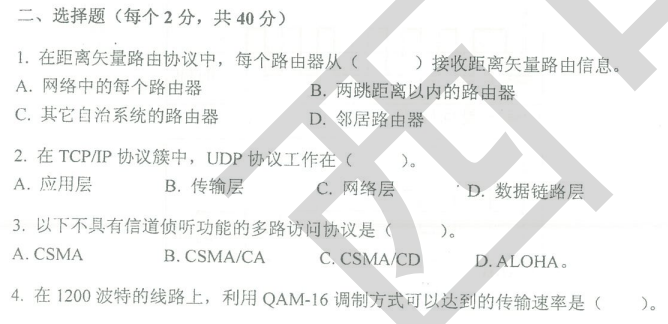
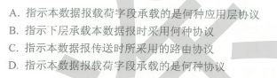
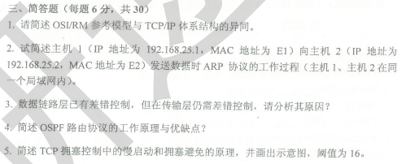

## 填空（1/20）

1.计算机网络协议的三个要素分别是 语法、语义和（）

2.IPv6 地址采用（）比特位表示。

3.典型的三种传输损伤包括（）、失真和噪声。

4.ICMP 报文封装在（）协议数据单元中传送。

5.在无线局域网中进行载波侦听多路访问时，存在（）问题和（）问题。802.11 协议中采用的多路访问协议是（）

6.局域网数据链路层被划分成（）和（）两个功能子层。

7.一个16端口的以太网交换机，有个（）冲突域和（）个广播域。

8.需要通过带宽为20kHz 的无噪声信道发送240kpbs，需要个信号电平（）

9.某主机IP 地址 192.223.240.160 和子网掩码 255.255.255.192，则相应的网络地址为，该子网最大可以容纳（）台主机

10.信息交换的方式有、报文交换和分组交换 3 种，其中，分组交换方式又分为（）和（）方式。

11.网络在物理层，数据链路层和网络层中互连的设备名称是（）

## 选择（2/40）

## 简答

## 计算

## 综合

