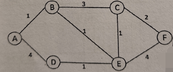
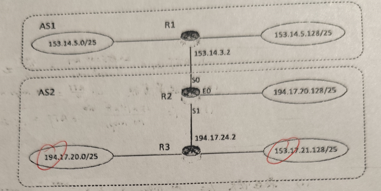
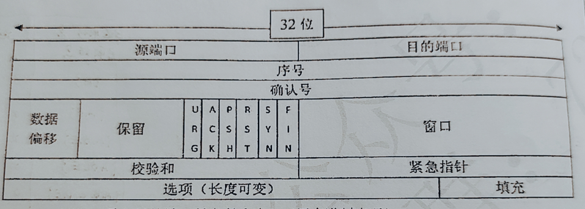

## 填空（2/40）

1.计算机网络协议的三个要素分别是（）、语义和（）

2.信号减损的三种类型包括：（）、失真和（）

3.无线局城网 MAC 层的接入控制机制分为（）和（），后者采用的接入算法是（）

4.若数据链路层采用选择重传 ARQ 的滑动窗口方法，发送的序列号用 8bit 表示，发送窗口的最大值为（）

5.IEEE 的 802 委员会已经标准化了很多种类的 LAN，其中无线 LAN 的标准是（）

6.一个32端口的以太网交换机，有（）个冲突域和（）个广播域

7.IPv6 地址采用（）比特表示,其报文头部中固定部分的长度是（）个字节

8.电子邮件的发送协议是 SMTP 电子邮件的接收协议有（）和 IMAP

9.在WLAN中进行载波侦听多路访问时，存在（）和（）问题

10.ICMP 报文封装在（）协议数据单元中传送

11.ARP 的功能是将（）地址转换成（）地址

## 选择（2/20）

1.在传输信道上，有一个 HDLC 的数据 0001 1111 0101 1，请问在被接收端接收后，它将会变成（）

- A.0001 1111 1011
- B.0011 1111 0101
- C.0001 1111 0111
- D.0001 1111 1101

2.停止等待协议的主要缺点是（）

- A.通信不可靠
- B.信道利用不高
- C.不能进行全双工通信
- D.需要大容量存储器

3.要发送的数据是 1101 0110 11，采用 CRC 做校验，给出的产生式（除数） 是 10011，那么最终发送的数据应该是（）

- A.1101 0110 1110 10
- B.1101 0110 1101 10
- C.1101 0110 1111 10
- D.1111 0011 0111 00

4.数据链路层采用了后退 N 帧协议，发送方已经发送了编号为 0-7 号的帧，当计时器超时没有收到 6 号的确认，则发送方需要重发的数据帧的个数为（）

- A.2
- B.3
- C.4
- D.5

5.标准以太网使用的介质访问方法是（）

- A.1-持续的 CSMA 方法
- B.1-持续的CSMA/CD 方法
- C.非持续的 CSMA/CD 方法
- D.p-持续的 CSMA 方法

6.在路由表中，通常的默认路由和掩码表示方式是（）

- A.255.255.255.255，0
- B.0.0.0.0，0
- C.255.255.255.255，255
- D.0.0.0.0，255

7.在TCP 协议中，假定发送方在发送了序号为 100、数据段为 100字节的报文段后，又发送了一个大小为 200 字节的报文段，那么接收方收到这两个报文段并且检查无错后发回的确认号是（）

- A.300
- B.401
- C.400
- D.301

8.IP 地址 10.224.12 的子网掩码为 255.240.0.0，和该地址在同一子网中的是（）

- A.10.223.21.121
- B.10.240.46.2
- C.10.236.23.171
- D.10.242.23.120

9.对于一块网卡，其功能不属于物理层的是（）

- A.规定网卡的接口形状、尺寸、引线数目和排列
- B.指明接口上的电压范围
- C.指明接口上某一电平的电压表示的意义
- D.规定网卡物理地址的格式定义

10.以下关于流量控制和拥塞控制的表述中，正确的是（）

- A.流量控制解决的是收发两个节点之间数据传送时的速率匹配问题，拥塞控制解决的是防止入网业务量超过网络的承载能力
- B.流量控制解决的是相邻两个节点之间的速率匹配问题，拥塞控制解决的是端到端的速率匹配问题
- C.流量控制只在链路层实现，拥塞控制只在传输层实现
- D.流量控制只在传输层实现，拥塞控制只在链路层实现

## 简答（6/30）

1.在数据链路层的 ARQ 滑动窗口协议中，序列号是模 2^m，m 是以位为单位的序列号字段长度。请简述，后退 N 帧 ARQ 协议的发送窗口的最大值是多少？为什么？

2.在 CSMA/CD 协议中，为什么要限定数据的小长度？标准以太网的最小长是多少比特？

3.互联网中，从主机的浏览器到服务器的 Web 服务之间，存在几级地址寻址？这些寻址站机制分别是什么？为什么多级寻址？

4.简述虚电路和数据报交换技术的特点

5.简述当前典型的 Web 邮箱都采用了哪些安全机制？

## 计算（10/60）

1.假定在地球和月球间建立 100Mbps 的链路。月球到地球的距离约为 385000km，数据在链路上以光速 3x10m/s 传输

- 1.计算该链路的最小RTT
- 2.计算该链路的延迟带宽积
- 3.如果地球从月球下载 25MB 的图像，从发出请求到传输结束至少要花多长时间?

2.假定 1km 长的 CSMA/CD 网络的数据率为 1000Mbps。设信号在网络上的传播速度为 200000km/s

- 1.求最短帧长
- 2.如果要求最短顿长减少 800bit，则最远的两个站点之间的距离应如何变化?

3.两个相邻节点A、B 采用滑动窗口协议，其序号占用 3bit，采用回退 N 帧 ARQ，发送窗口为 5。对于下列事件，说明可以继续发送的顿号，并画出发送方窗口的位置

- 1.在 A 发送数据之前
- 2.在 A 发送数据 0、1、2 之后，B 应答了0、1，并且 A 收到了这些应答
- 3.在 A 发送数据 3、4、5 之后，B 应答了 4 号，并且 A 收到了这些应答

4.按下图的拓扑结构，使用 Dijkstra 算法求出节点 A 到节点的最小费用路径（以表的形式给出详细的计算过程），并给出以 A 为顶点的最小代价通路树

5.假设自治域 AS1 由路由器 R1 连接两个子网构成，自治域 A2 由路由器 R2、R3 互联并连接3个子网构成。各子网地址、R2 的接口、R1 与 R3 的部分 IP 地址如下图所示，请回答以下问题

- 1.假设路由表结构如下表所示。利用路由聚合技术，给出 R2 的路由表，要求包括到达图中所有子网的路由，且路由表的路由项尽可能少

  | 目的网络 | 下一跳 | 接口 |
  | -------- | ------ | ---- |

- 2.若 R2 收到一个目的 IP 地址为 194.17.20.200 的分组，R2 会通过哪个接口转发？

- 3.R1 和 R2 之间使用哪个路由交换协议交换路由信息？该路由协议的报文封装在哪个协议中进行传输？

6.一个TCP首部的数据信息（十六进制表示）为 0x0D 2800 1550 5FA9 0600 0000 0070 0240 00C0 2900 00。TCP 首部格式如图所示，请回答

- 1.源端口号和目的端口号各是多少？（用十进制表示）
- 2.发送的序列号是多少？确认号是多少？
- 3.这是一个使用什么协议的 TCP 连接？该 TCP 连接的状态是什么？
