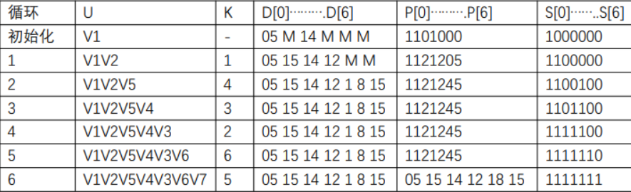

## 单选

1-5 BCDAC

6-10 DABDB

11-15 BACDB

## 填空

1、(rear-front+M)%M

2、可行性

3、01122123412234

4、最优子结构性质和子问题重香性质

5、3

6、24000bit/s

7、单工、半双工、全双工

8、100s、5x10^3

9、信息帧、监督帧和无编号帧

10、11111001111101110111

11、维吉尼亚密码

12、8

13、23

14、有无密钥

15、(18,20)

## 简答

1

朴素的模式匹配思想是：从目标 S 中的第一个字符开始和模式 T 中的第一个字符比较（用 i 和 j 分别指示 S 串和 T 串中正在比较的字符位置），若相等，则继续逐个比较后续字符，否则从目标 S 的第二个字符开始再重新与模式串的第一个字符比较，依次类推，直至模式 T 中的每个字符依次和目标S 中的一个连续字符序列相等为止，则匹配成功，返回模式 T 中第一个字
符在目标 S 中的位置，否则匹配失败，返回 -1 值

KMP 的改进之处在于：每当一趟匹配过程中出现字符比较不相等时，不需回溯i值，而是利用已经得到的“部分匹配"的结果将模式向右“滑动”尽可能远的一段距离后，继续进行比较

表述清楚主串模式串之间的回溯，可以通过 next 数组消除回溯，设计 next 数组时可以通过最长前缀找到回溯位置等问题即给分

2

0-1 背包问题是指每一种物品都只有一件，可以选择放或者不放

背包问题(Knapsack problem)：是一种组合优化的 NP 完全问题。问题可以描述为：给定一组物品，每种物品都有自己的重量和价格，在限定的总重量内，我们如何选择，才能使得物品的总价格最高

背包问题可以用贪心算法求解，而 0-1 背包问题不能用贪心算法求解（用动态规划）

参照书本，表述清楚两个问题的概念，比较他们的不同点，如何解决这两个问题，即可给分（为什么 0-1 背包问题不可用贪心，这个最好提一下）

3

确认帧，超时重传，滑动窗口，答到三点内容并解释清楚即给分

4

相同点

- 都是动态路由协议
- 都是内部路由协议
- 如果 RIP 是版本 2（RIPv2）的话，那 OSPF 一样都支持变长子网掩码，支持 VLSM。

不同点

- RIP 是按跳数来算路由的，OSPF 是状态路由协议
- RIP 的算法简单，但在路径较时收敛速度慢，广播路由信息时占用的带宽资源较多，它适用于网络拓扑结构相对简单且数据链路故障率极低的小型网络，在大中型企业网络中，一般不使用 RIP
- OSPF 不会产生路由环路，不受路数限制，能够用于规模很大的网络，收敛速度快，支持大型异构网络的互联，并且不容易出现错误的路由信息，同时支持多重路径，支持路由验证提高了网络的安全性，支持负载均衡，支持 VLSM 

5

ELGamal 签名体制

- 体制参数
  - p：大素数
  - g：Zp 的一个生成元
  - x：用户私钥
  - y：用户公钥
- 签名产生过程
  - 计算 m 的哈希值 H(m)
  - 选择随机数 k，计算 r = g^k (mod p)
  - 计算 s = (H(m)-xr)k^(-1) (mod p-1)
- 以 (r,s) 作为数字签名
- 验证过程

$$
y^rr^s=g^{rx}g^{ks}=g^{H(m)}\,(mod\,p)
$$

## 应用

1

A：01011&emsp;&emsp;B：0100&emsp;&emsp;C：011

D：110&emsp;&emsp;E：1110&emsp;&emsp;F：00

G：10&emsp;&emsp;H：01010&emsp;&emsp;I：1111

2

线性探查法

- 查找成功：2.5
- 查找不成功：7

拉链法

- 查找成功：1.67
- 查找不成功：0.923

3

4

活动和事件开始最早时间，最晚时间，要求全部写出

关键路径 <V1,V2>，<V2,V4>，<V2,V5>，<V4,V5>，<V5,V7>

5

不正确，正确的为 01100

