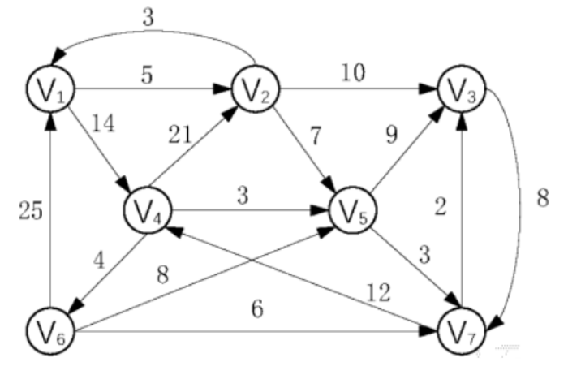
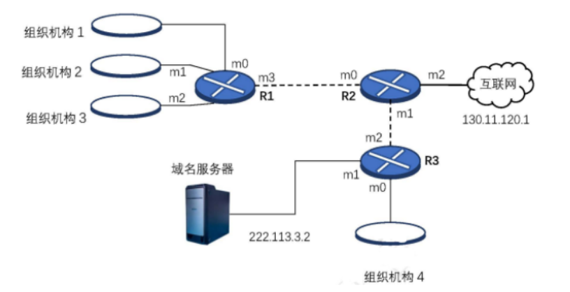
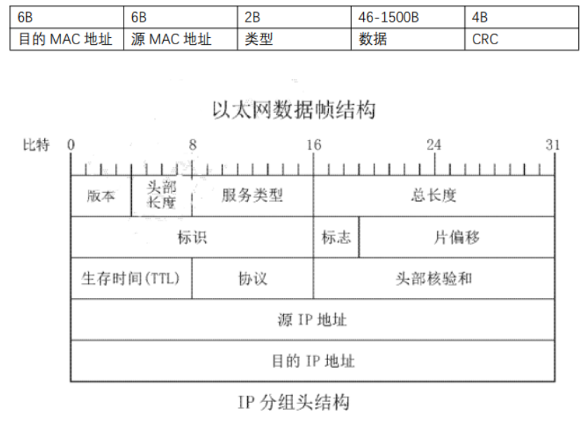

## 选择

1.下列程序结束时，x 的取值为（）

```c
x=91, y=100:
while (y > 0)
    if(x > 100) {
        x = x-10;
        y--;        
    } else {
        x++;
    }
}
```

- A.90
- B.91
- C.92
- D.100

2.4 个结点最多构造成（）种不同的树

- A.12
- B.13
- C.14
- D.15

3.在双向循坏链表的指针 p 所指的结点之前插入指针 s 所指的结点的操作是（）

- A.s->prior = p->prior; p->prior = s; s->next = p; p->prior->next = s;
- B.s->next = p; p->prior->next = s; p->prior = s; s->prior = p->prior;
- C.s->prior = p; s->next = p->next; p->next->prior = s; p->next->prior = s;
- D.p->prior->next = s; s->prior = p->prior; s->next = p; p->prior = s;

4.设将三对角矩阵 A[n][n]按行优先存储在数组 B[3*n-2]之中，按列优先存储在 C[3*n-2]中元素 BD在原三对角矩阵里对应元素 Cm,所有数组标号均从 0 开始，i和的关系表达式为（）

- A.j=2i-3(i+1)/3
- B.j=2i-3(i+2)/3
- C.j=3i-3(i+1)/3
- D.j=2i-2(i+1)/3

5.4 个结点最多构造成（）种不同的树

- A.12
- B.13
- C.14
- D.15

6.在局域网中，交换机根据（）转发顿

- A.目的网络地址
- B.源网络地址:
- D.目的 MAC地址
- C.原MAG 地址

7.FTP 协议中控制连接端口和连接方式为（）

- A.TCP 21
- B.TCP 20
- C.UDP 21
- D.UDP 20

8.因特网的前身是（）

- A.X.25NET
- B.ARPANET
- C.MILNET
- D.CERNET

9.测试计算机网络时发送的 ping 包属于（）协议

- A.IP
- B ARP
- C.RARP
- D ICMP

10.下列 IP 地址属于 B 类地址的是（）

- A.64516
- B.130.53.42.10
- C.200.245.20.11
- D.221.121.16.12

11.设 n=4，有 f(a1,a2,a3,a4)= a5，其初始状态为 (a1,a2,a3,a4) = (1,1,0,1)，此反馈移位寄存器的周期为（）

- A.4
- B.5
- C.6
- D.7

12.AES 加密算法的密钥长度不可能是（）

- A.64位
- B.128位
- C.192位
- D.256位

13.关于数字签名下列说法不正确的是（）

- A.非对称密码体制的出现解决了数字签名问题
- B.数字签名可由对称密码、公钥密码以及数字签名算法实现
- C.使用对称密码体制进行数字签名时，如果存在第三方，会产生抵赖问题
- D.数字签名算法都基于数字田困难问题

14.关于椭圆曲线加密算法(ECC 的说法不正确的是（）

- A.圆曲线加密算法是基于椭圆曲线上的离散对数困难问题
- B.圆曲线加密算法属于非对称算法
- C.圆曲线加密算法在实现方式上有不同的变化
- D.对于椭圆曲线方程 y3=x3+ax+b，需要满足 4a3+27b2=0

15.RFC1321 中以下关于 MD5 的说法正确的有（）

- A.MD5 是一个消息摘要算法标准
- B.MD5 的输入可以为任意长，但其输出是 128 位
- C.MD5 的输入不能为任意长，但其输出是 128 位
- D.当 MD5 的输入长度为 448bit 时，消息无需填充

## 填空

1.已知循环队列中的头指针 front 和尾指针 rear，队列长度为 M 则当前队列中元素个数为（）

2.算法的每条指令都应在有限的时间内完成这被称为算法的（）

3.模式串 abaacabacaabac 的 next 数组为（）

4.动态规划算法具有（）性质和（）性质

5.在长度为Ⅱ的顺序存储线性表中，采用折半查找法的平均查找长度为（）

6.对于带宽为 6kHz 的信道，假设离散电平为 4，信噪比为 30dB，则信道极限传输速率为（）(lg1001≈10)

7.计算机的通信模式有（）

8.收发双端传输距离为1000km，信号在媒体上的传播速率为 2X10m/s。试计算数据长度 10^7 数据发送速率为 100kb/s 的情况下的发送时延为（），传输时延为（）

9.HDLC 顿分为（）、（）和（）三种.

10.用比特填充法对比特序列 1111111110111 组后结果为（）

11.属于分组密码的古典密码是（）

12.在 j = 8 的 CFB 模式中，如果密文在传输过程中有 1bit 的错误，该错误会影响除该组的（）组结果

13.设在 RSA 的公钥密码体制中，公钥为 (e,n) =(7,55)，则私钥 d=（）

14.消息认证函数与哈希函数的区别是（）

15.己知 E-23 的椭圆曲线密码体制，对其楠圆曲线上的两点 P = (5,19)、O = (9.7)，求运算 P+O = （）

## 简答

1.请述 KMP 算法的运算过程

2.分别简述 0-1 背包问题和背包问题的概念和解决方法

3.请简述 TCP 协议如何实现可告传输

4.请简述 RIP、OSPF 的相同点与不同点

5.请简述 Elgamal 签名体制？

## 应用

1.(5分) 假设用于通信的电文由一下几种不同的符号组成，各个符号在电文中出现的频率如下所示	A:8，B:11，C:31，D:32，E:14，F:37，G:62，H:5，I:20，请画出这个符号的哈夫曼树(要求左孩子比右孩子小)，并给出相对应的编码

2.(5分) 设散列表长度为 15，散列函数为 H(k) =k%13，给定的关键字序列为  19，14，23，01，68，20，84，27，55，11，10，79。试画出分别用拉链法和线性探查法解决冲突时所构造的散列表并分别求出在等概率情况下，两种方法的查找成功和查找不成功的平均查找长度

3.(5分) 有向网络 G 如图所示，试从 V1 开始用 dijikstra 算法求出最短路径



4.(8分) 在一个 AOE 网络中包括 7 个事件和 10 个活动，其中 <v1,v2>=3，<v1,v3>=2，<v2,v4>=4，<v3,v4>=3，<v2,v5>=8，<v3,v6>=7，<v4,v5>=4，<v4, v6>=2，<v5,v7>=9，<v6,v7>=6。求出所有事件和活动的最早最晚发生时间和关键路径

5.(7分) 校验生成多项式 x4+x2+x1+1 接受的报文 101010001101 是否正确，给出校验过程，若不正确，设报文数据部分正确，那正确的校验码应该是多少？

6.某网络如图所示，现将网络地址空间 140.24.7.0/24 按子网号从小到大的顺序分别分配给组织机构 1、2、3、4，其中每个组织机构的主机数相等，R1 路由器的 m0、m1、m2 接口 IP 地址均为该局域网的第一个可用 IP 地址，m3 接口的 IP 地址为 222.118.23，R2 路由器 m0、m1、m2 接口的 IP 地址分别为 222.118.2.2、222.118.2.1、130.1.120.1，R3 路由器的 m1、m2 接口 IP 地址为 222.118.3.1、222.118.3.3，m0 为该对应局域网的第一个可用 IP，域名服务器为 222.118.3.2



- (1) 分别写出组织机构 1，2，3，4 的 IP 地址(2分)
- (2) 请完成下列路由表(8分)

R1 路由表

| 子网掩码 | 网络地址    | 下一跳地址 | 接口        |
| -------- | ----------- | ---------- | ----------- |
| /26      | 140.24.7.0  | Direct     | 140.24.7.1  |
| /26      | 140.24.7.64 | Direct     | 140.24.7.65 |
|          |             |            |             |
| /0       | 0.0.0.0     | 默认       | 222.118.2.3 |

R2 路由表

| 子网掩码 | 网络地址     | 下一跳地址  | 接口         |
| -------- | ------------ | ----------- | ------------ |
| /26      | 140.24.7.192 | 222.118.3.3 | 222.118.2.1  |
|          |              |             |              |
|          |              |             |              |
| /0       | 0.0.0.0      | 默认        | 130.11.120.1 |

R3 路由表

| 子网掩码 | 网络地址    | 下一跳地址 | 接口        |
| -------- | ----------- | ---------- | ----------- |
|          |             |            |             |
| /32      | 222.118.3.2 | Direct     | 222.118.3.1 |
| /0       | 0.0.0.0     | 默认       | 222.118.3.3 |

7.如下图所示某主机进行 web 请求的一个以太网数据前 80 个字节的十六进制及 ASCII 码内容


- (1) 求主机的源 MAC 地址和源 IP 地址(3分)
- (2) 求该报文段 IP 数据报总长度为多少？位偏移量是多少？(3分)
- (3) 结合该数据报文分析该主机请求通信中可能使用了哪些协议，并简述这些协议功能？(4分)

帧结构如下图所示



8（这道题第二问有问题，我得到的版本就是这样，就别写）

- (1) 简述两者之间如何进行密钥交换，并说明该方法有什么缺陷(6分)

- (2) 定义三个素数 p 阶循环群 G1，G2 和 GT，定义映射 e:G1·G2 —> GT

  满足如下性质：

  1. 对于 ∀g1∈G1，g2∈G2，∀a,b∈Zp，有 e(g1·a, g2·b)=e(g1, g2)·ab
  2. 对于 ∀g1∈G1，g2∈G2，均可计算 e(g1,g2)
  3. ∃g1∈G1，g2∈G2， 使得 e(g1,g2) ≠ lcr

  基于以上，设计一个三方密钥交换算法。(9 分)

