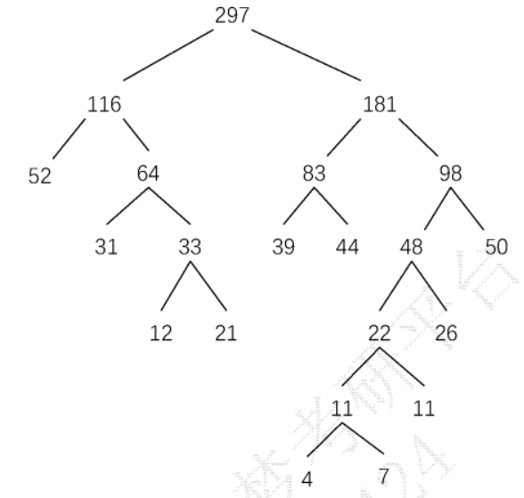
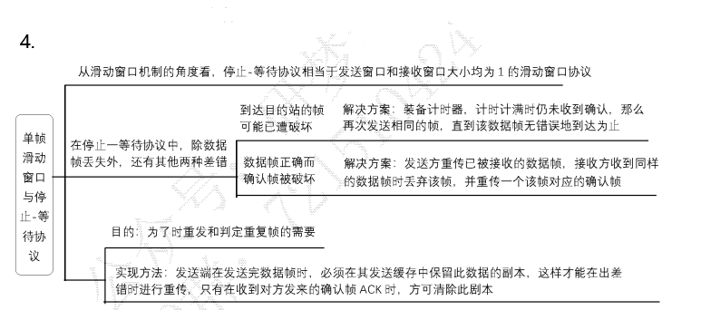
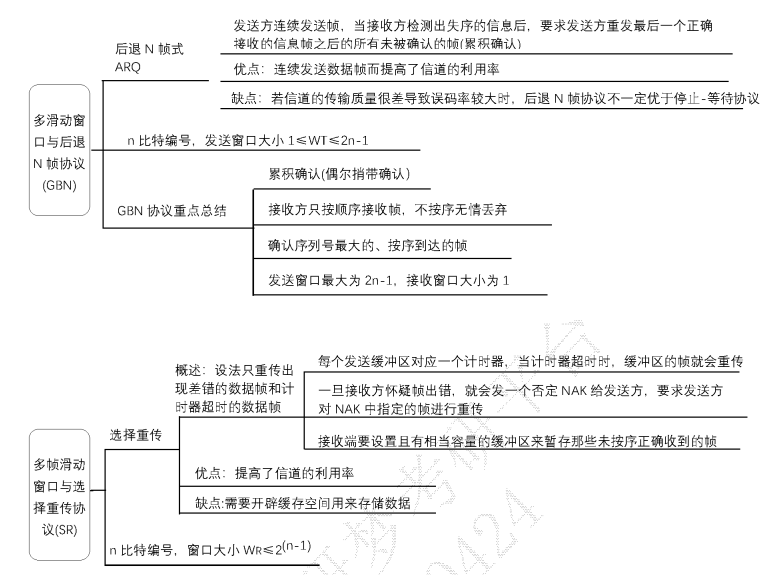
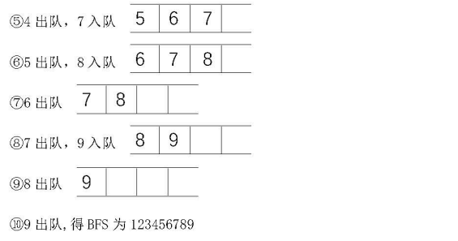
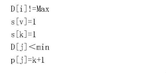
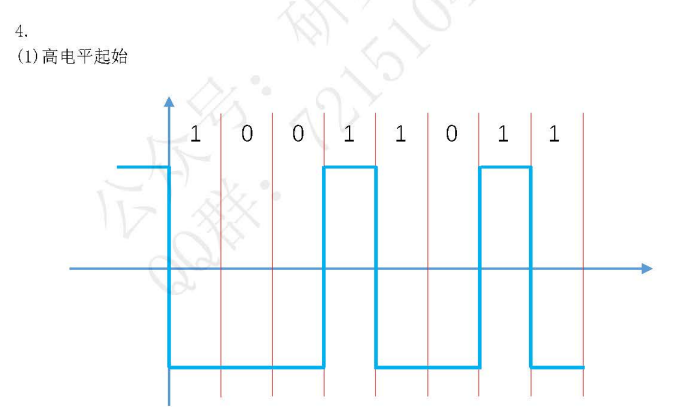

## 选择

1-5 DCDBC

6-10 ACDBB

11-15 DBABC

## 填空

1、先序遍历：ABDEGCF

2、静态数组

3、n(n-1)/2

4、4

5、14

6、11

7、D

8、140.9.17.32

9、25ms

10、5.12 μs

11、Ek1(Dk2(Ek1(m)))

12、S 盒

13、2

14、2^(m/2)

> 解析：据生日攻击(或生日悖论)的原理，对于一个随机函数，其输出有 个可能的不同结果，要得到一个碰撞的概率超过 50%，你需要大约 n 个随机输入。在这里，哈希函数 H(x) 的输出长度为 m 位。所以它有 2^m 个可能的输出结果。所以输入次数至少为 2^(m/2)

15、密钥

16、13

## 简答

1

哈夫曼树



带权路径长度：WPL = 52x2 + (31+39+44+50)x3 + (12+21+26)x4 + 11x5 + (4+7)x6
=104+492+236+55+66 = 953

2

```c
bool ListDelete(SqList &L Elemtype x){
    if(L.length==0)
        return false;
    int i = L.front;
    int count = 0;
    while (i != L.rear){
        if(L.data[i] == x){
            count++;
            i= (i+1)% MAXSIZE;
        } else{
            L.datal(i-count+MAXSIZE) % MAXSIZE] = L.data[i];
            i = (i+1) % MAXSIZE;
        }
    }
    if (L.data[i] == x){
        count++:
    }
    L.rear = (L.rear - count + MAXSIZE) % MAXSIZE;
    L.length -= count;
    return true;
}
```

3

1-坚持 CSMA

- 原理：一个结点要发送数据时，首先监听信道，如果信道空闲，那么立即发送数据:如果信道忙，那么等待，同时继续监听直至信道空闲;如果发生冲突，那么随机等待一段时简后，再重新开始监听信道
- 优点：提高信道利用率
- 缺点：若有两个或更多的站同时在监听信道，一旦信道空闲就必然发生冲突

非坚持 CSMA

- 原理：一个结点要发送数据时，首先监听信道，如果信道空闲，那么立即发送数据:如果信道忙，那么放弃监听，等待一个随机的时间后再重复上述过程
- 优点：采用随机重传时间减少碰撞概率
- 缺点：延迟时间内可能会出现通道闲的情况，利用率不高

4





5

Elagmal 更能抵抗选择明文攻击。EIGamal 加密本身就是一个概率性的算法。它为每次加密引入了随机元素，这意味着同一个明文被加密两次可能会产生两个不同的密文。这种内置的随机性使 EIGamal 固有地能够抵抗选择明文攻击

RSA 本身是一个确定性的加密算法：给定相同的公钥和明文，它总是产生相同的密文。因此，RSA 是易受选择明文攻击的


## 计算

1


2




3



4

(1)

高电平起始



低电平起始


(2)

A：曼彻斯特

B：差分曼彻斯特

编码：01100110

7

(a) (2, 4)

(b) (8, 3)、(5, 2)

8

(a)

e = 3 的优点是计算快，因为其二进制表示中只有 2 个 1，缺点是不安全，当明文较时，直接开立方可求出明文。且 e = 3 时，易受低指数攻击

(b) 


