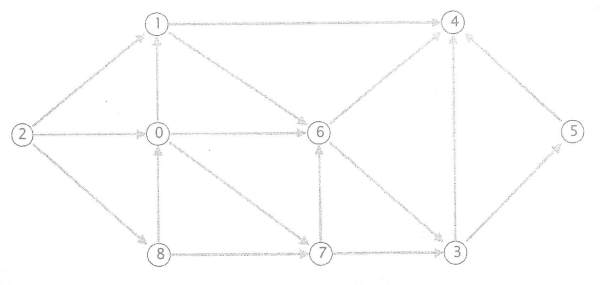

## 单选（2/30）

1.抽象数据类型的三个组成部分不包括（）

- A.数据对象
- B.数据类型
- C.基本操作
- D.数据关系

2.对于顺序表，以下说法错误的是（）

- A.顺序表是用一维数组实现的线性表，数组的下标可以看成是元素的绝对地址。
- B.顺序表的所有存储结点按相应数据元素间的逻辑关系决定的次序依次排列。
- C.顺序表的特点是逻辑结构中相邻的结点在存储结构中仍相邻。
- D.顺序表的特点是逻辑上相邻的元素，存储在物理位置也相邻的单元中

3如果用尾指针(rear)来表示带头结点的单循环链表，那么其头结点和尾结点的存储位置分别是（）

- A.rear 和 rear->next->next
- B.rear->next 和 rear
- C.rear->next->next 和 rear
- D.rear 和 rear->next

4.将长度为 n的顺序表中的结点循环右移k 位的算法的时间复杂度为（）

- A.O(k)
- B.O(n*k)
- C.O(n)
- D.O(n+k)

5.设输入序列是 1、2、3、4、5、6，则通过栈的作用后可以得到的输出序列是（）

- A.5、3、4、6、1、2
- C.3、1、2、5、4、6
- B.3、2、5、6、4、1
- D.1、5、4、6、2、3

6.当利用大小为 n 的数组顺序存储一个队列时，该队列的最大长度为（）

- A.n-2
- B.n-1
- C.n
- D.n+1

7.二叉树作为非线性数据结构，它能使用的存储结构是（）

- A.顺序结构
- B.链式结构
- \C.顺序结构和链式结构都可以
  D.顺序结构和链式结构都不可以

8.设某哈夫曼树中有 999 个结点，则此哈夫曼树中有（）个叶子结点

- A.499
- B.500
- C.501
- D.502

9.深度为 7 (根的层次为 1) 的完全二叉树至少有（）个结点

- A.62
- B.63
- C.64
- D.65

10.6个顶点的无向图成为一个连通图至少应有（）条边

- A.4
- B.5
- C.6
- D.15

11.对于一个有n 个顶点和e条边的无向图，进行拓扑排序时，总的时间为（）

- A.n
- B.n+1
- C.n-1
- D.n+e

12.下列方法中，（）不是散列函数的构造方法

- A.数字选择法
- B.除留余数法
- C.随机数法
- D.开放地址法

13.以下说法错误的是（）

- A.散列法存储的基本思想是由关键字的值直接计算出数据的存储地址
- B.装填因子是散列法的一个重要参数，它反映散列表的装填程度
- C.散列表的结点中只包含数据元素自身的信息，不包含任何地址
- D.散列表的查找效率主要取决于散列表造表时选取的散列函数和处理冲突的方法

14.关于动态规划算法下列说法不正确的是（）

- A.备忘录方法是动态规划算法的一个变形
- B.适用于动态规划法求解的问题，经分解得到的子问题是互相独立的
- C.动态规划法通常用于求解具有某种最优性质的问题
- D.以自底向上的方式计算最优值

15.以下能用贪心算法解决的问题是（）

- A.矩阵连乘问题
- B.整数划分问题
- C.0-1背包问题
- D.背包问题

## 判断题（1/15）

1.定义逻辑结构时可不考虑物理结构（）

2.线性表采用顺序存储，必须占用一片连续的存储单元（）

3.对于线性表来说，定位运算在顺序表和单链表上的时间复杂度均为 O(n)（）

4.循环队列的引入，目的是为了克服溢出（）

5.在具有n个单元的循环队列中，队满时共有 n个元素（）

6.若某内部排序算法不稳定，则该算法没有使用价值（）

7.如果两个串含有相同的字符，则这两个串相等（）

8.一棵完全二叉树可以存在度不为 2的非叶子结点（）

9.树最适合用来表示元素之间具有分支层次关系的数据（）

10.在哈夫曼树中，权值最小的结点离根节点最近（）

11.在一个图中，所有顶点的度数之和等于所有边的数目的2倍（）

12.任何无环的有向图，其节点都可以排在一个拓扑排序里（）

13.带权连通图的最小生成树的权值之和一定小于它的其它生成树的权值之和（）

14.平方取中法需要事先掌握关键字的数字分布情况（）

15.快速排序算法在最坏情况下就变成了冒泡排序（）

## 填空（2/30）

1.若将数据结构形式定义为二元组 (K，R)，其中K 是数据元素的有限集合，则 R 是 K 上（）

2.一个顺序表的第一个元素的存储地址是 0x12f7c，每个元素的长度是 4，则第 3 个元素的地址是（）

3.对于顺序表，定位运算的时间复杂性为（）

4.在双向链表中求某个结点的前驱结点的算法的时间复杂度是（）

5.一般情况下，将递归算法转换成等价的非递归算法应该设置（）

6.串是（）个字符的序列

7.含有3 个结点 a，b，c，且先序序列为 abc 的二叉树一共有（）种

8.已知一棵满二叉树的结点个数为 20到40之间的素数，则此二树的深度为（）

9.存储完全二叉树的最简单、最省空间的存储方式是（）

10.一个具有 n 个顶点和 e 条边的无向连通图，利用克鲁斯卡尔算法产生的最小生成树其时间复杂度为（）

11.一个具有 n个顶点e条边的无向图的邻接矩阵中，零元素的个数为（）

12.在索引表中，若一个索引项对应数据表中的一个记录，则称此索引为（）索引

13.发生冲突的两个关键字称为散列函数的（）

14.动态规划法的一个变形是（）方法

15.背包问题和0-1背包问题都具有（）性质

## 问题求解（45）

1.(7分) 设有一组关键字序列 (46,34,65,72,31,12,75,10,55)。散列表长为 13

- (1) 请设计一个适当的散列函数(采用除留余数法)
- (2) 画出用拉链法构造的散列表(链表中插入结点时采用尾插法)
- (3) 写出拉链法构造的散列表在等概率的情况下，查找成功的平均查找长度和查找不成功时的平均查找长度

2.(7分) 对给定的一组关键字：45，23，67，12，88，41，90，120，60，100，54，16，画出应用归并排序对上述序列进行排序中各趟归并的结果

- 第一躺归并后：`[][][][][][]`
- 第二躺归并后：`[][][]`
- 第三躺归并后：`[][]`
- 第四躺归并后：`[]`

3.(7分) 在如下数组R中链接存储了一个线性表，表头指针为 R[3].next，试按照下面格式写出该线性表

| R        | 0    | 1    | 2    | 3    | 4    | 5    | 6    | 7    | 8    |
| -------- | ---- | ---- | ---- | ---- | ---- | ---- | ---- | ---- | ---- |
| **data** | zhou | li   | zhao |      | wu   | sun  |      | wan  | song |
| **next** | 1    | 7    | 4    | 2    | 8    | NULL |      | 5    | 0    |

线性表为：（	,	,	,	,	,	,	）

4.(8分) 按要求画出对应的树或森林

- (1) 画出下图的树对应的二叉树


- (2) 画出下图的二叉树对应的森林


5.(8分) 假设用于通信的电文仅由 8 个字母 (a,b,c,d,e,g,h) 组成，字母在电文中出现的次数分别为 (7,18,2,6,30,3,20,9)，画出哈夫曼树(要求左子树的权值小于右子树)，并给这8个字母设计哈夫曼编码表

6.(8 分) 如下是一个有向无环图，假设邻接表是有序排列的:例如，当遍历 0 节点的出边时，边 0->1出现在 0->6 和 0->7之前

- (1) 计算拓扑排序，列举节点在后进先出栈中的出栈顺序
- (2) 从节点2开始进行广度优先搜索，列举节点在先进先出队列中的出队顺序



## 算法设计（10/30）

1.已知头指针分别为 l1 和 l2 的带头结点的单链表中，结点按元素值递增有序排列。写出将 l1 和 l2 两个链表合并成一个结点按元素值递增有序排列的单链表，要求不另外开辟空间，用 l1 的头结点作为合并后的单链表的头结点

```c
linklist*Union(linklist *la, linklist *lb){
    linklist*p, *q, *r, *s;
    /*在此后作答*/
}
```

2.设二叉树的存储结构为二叉链表，编写二叉树递归算法 int Degrees 2(BTNode*t)，统计二叉树中度为2的结点个数

```c
typedef struct Node{
    datatype data;
    ____①____; //左右孩子指针
}BTNode;

int Degrees_2(BTNode* t){
    if(t== NULL)
        return ____②____;
    if(____③____)
        return __④__ + __⑤__ + __⑥__;
    else
        return __⑦__ + __⑧__;
}
```

3.设有两个集合 A 和集合 B，要求设计生成集合 C = A ∩ B 的算法，其中集合 A、B 和 C 用链式存储结构表示

```c
typedef struct node{
    int data;
    struct node *next;
}lklist;

void intersection(lklist *ha, lklist *hb, lklist *&hc){
    
}
```


