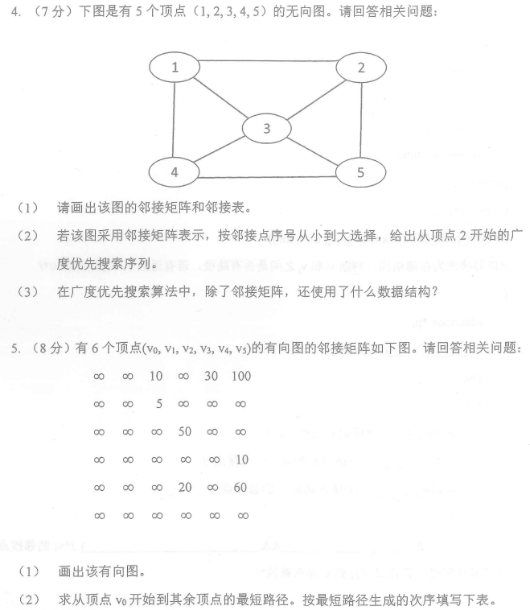
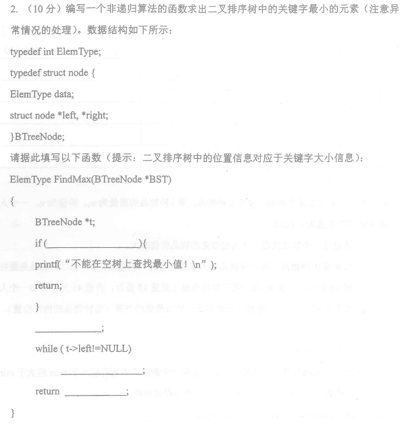
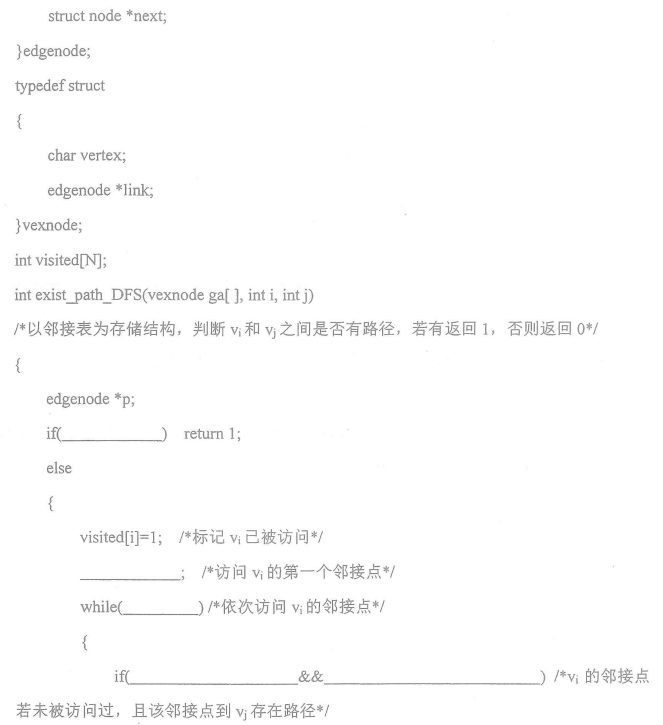

## 单选

1.计算机算法指的是

- A. 计算方法
- B. 解决问题的步骤序列
- C. 排序方法
- D. 调度方法

2.顺序表比链表

- A. 更便于随机读取
- C. 插入和删除更简便
- B. 数据元素的物理存储范围更分散
- D. 更适合线性逻辑结构

3.在一个长度为n的顺序表的第i(lSiSn+1)个位置上插入一个元素，需要后移()
个元素。

- A. n-i
- B. n-i-l
- C. n-i+1
- D. n+i

4.要从一个顺序表删除一个元素时，被删除元素之后的所有元素均需()一个位置
移动过程是从()向()依次移动一个元素。

- A. 前移，后，前
- B. 前移，前，后
- C. 后移，后，前
- D. 后移，前，后

5.向一个栈顶指针为 top 的链栈中插入一个s 结点，应执行()

- A. top->next=s;
- B. s->next-top;top=s;
- C. s->next-top->next; top->next=s;
- D. s->next-top;top = top->next;

6.设某二叉树中度数为 0 的结点数为 N0，度数为 1 的结点数为 N1，度数为 2 的结点数为 N2，则下列等式成立的是()

- A. N0 = N1+1
- B. N0 = N1+ N2
- C. N0 = N2+1
- D. N0 = 2N1+1

7.一棵二叉树的后序遍历序列为 C、A、E、B、D，中序遍历序列为D、A、C、B、E,
则先序遍历序列为()

- A. D、B、A、C、E
- C. C、E、D、B、A
- B. D、A、B、E、C
- D. C、B、D、A、E

8.Huftman 树的带权路径长度等于()

- A. 除根结点之外的所有结点权值之和
- C. 各叶子结点的带权路径长度之和
- B. 所有结点权值之和
- D. 根结点的值

9.设有6个顶点的无向图，该图至少有()条边，才能确保是一个连通图

- A. 5
- B. 6
- C. 7
- D. 8

10.设某无向图中有 n 个顶点e 条边，则建立该图邻接表的时间复杂度为()

- A. O(n+e)
- B. O(n2)
- C. O(ne)
- D. O(n3)

11.若图的邻接矩阵中主对角线上的元素全是 0，其余元素全是 1，则可以断定该图一定是()

- A. 无向图
- B. 不是带权图
- C. 有向图
- D. 完全图

12.已知采用开放地址法解决散列表冲突，要从此散列表中删除一个记录，正确的做法是

- A. 将该元素所在的存储单元清空
- B. 在该元素上做删除标记。
- C. 将与该元素有相同 Hash 地址的后继元素顺次前移一个位置。
- D. 用与该元素有相同Hash 地址的最后插入表中的元素替代。

13.散列函数有一个共同性质，即函数值应当以()取其值域的每个值

- A. 最大概率
- B. 最小概率
- C. 平均概率
- D. 等概率

14.快速排序方法在()情况下最不利于发挥其长处

- A. 要排序的数据量太大
- B. 要排序的数据中含有多个相同值
- C. 要排序的数据已基本有序
- D. 要排序的数据个数为奇数

15.在归并排序过程中，需归并的趟数为()

- A. √n
- B. ⌈lbn⌉
- C. n
- D. ⌊lbn⌋

## 判断

1.线性表中的所有元素都有一个前驱元素和后继元素（）

2.栈和队列的存储方式只能是链接方式（）

3.查找和修改是对数组的基本操作（）

4.二叉树的后序遍历序列中，任意一个结点均处在其孩子结点的后面（）

5.一个含有 n 个结点的完全二叉树，它的高度是 ⌊ logn ⌋+1（）

6.当向二叉排序树中插入一个结点，则该结点一定成为叶子结点（）

7.调用一次深度优先遍历可以访问到图中的所有顶点（）

8.带权无向图的最小生成树是唯一的（）

9.如果表示某个图的邻接矩阵是不对称矩阵，则该图一定是有向图（）

10.在一个有向图的拓扑序列中,若顶点a在顶点b之前,则图中必有一条弧<a, b>（）

11.在散列法中，散列函数必须是一个一对一的函数（）

12.散列表发生冲突的可能性与装填因子无关（）

13.索引顺序结构和索引非顺序结构的索引表中索引项都是按照关键字顺序排列的（）

14.对 个元素执行快速排序，在进行第一次划分时，关键字的比较次数总是 n-1 次（）

15.归并排序算法中辅助组所需的空间复杂度为 O(n)（）

## 填空

1.数据的物理结构主要包括 ____ 和 ____ 两种情况

2.顺序表中逻辑上 ____ 的元素的物理位置相邻

3.在双向循环链表中，在m 所指的结点之后插入 n 指针所指的结点，其操作是 ____; n->next = m->next; m->next->prior = n; m->next=n;

4.设有一个空栈，现有输入序列 (a,b,c,d,e)，经过 push，push，pop，push，pop，push，push 的操作，输出序列是 ____

5.两个字符串相等的充要条件是两个串的 ____ 相等和对应位置的字符相等

6.装有n个叶子的哈夫曼树的结点总数为 ____

7.设二叉树中结点的两个指针域分别为 lchild 和 rchild，则判断指针变量 p 所指向的结点为叶子结点的条件是 ____

8.根据初始关键字序列(19、22、01、38、10)建立的二叉排序树的高度为 ____

9.设一棵二叉树的前序序列为 ABC， 则有 ____ 种不同的二叉树可以得到这种序列

10.解决散列表冲突的两种方法是 ____ 和 ____

11.对于一个具有 n 个顶点和 e 条边的无向图，如果采用邻接表存储方法存储该无向图边表中所含结点有 ____

12.在一个具有 n 个顶点的完全有向图中，包含有 ____ 条边

13.设某无向图中顶点数和边数分别为 n 和 e，所有顶点的度数之和为 d，则 e = ____

14.对一个长度为 n 的任意文件进行排序，至少需要 ____ 次比较

15.对n个元素进行冒泡排序时，最少的比较次数是 ____

## 问题求解

## 算法

