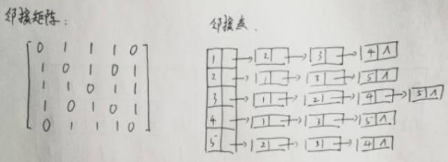
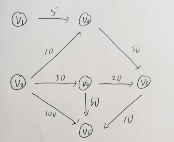

## 单选

1-5 BACBB

6-10 CACAA

11-15 DBDCB

## 判断

1-5 FFTTT

6-10 TFFTF

11-15 FFTTT

## 填空

1、顺序存储结构;链式存储结构

2、相邻

3、n->prior = m

4、(b,c,e,d,a)

5、长度

6、2n-1

> 二叉树中，叶子结点数比双分支结点数多 1，而哈夫曼树只有度为 0 和度为 2的两种结点，故总结点数为 n+(n-1)=2n-1。

7、p -> lchild == NULL && p -> rchild == NULL

8、3

9、5

10、开放寻址法；拉链法

11、2e

12、n(n-1)

13、d/2

14、O(nlbn)

15、n-1

## 问题求解

> 答案来自仓库：[sizaif/XDU_953](https://github.com/sizaif/XDU_953)

1

(1)


(2)

WPL = 45x1 + (12+13+16)x3 + (5+9)x4 = 224

2


前序序列：A B D E C

中序序列：D B E A C

后序序列：D E B C A

3

| 散列地址     | 0    | 1    | 2    | 3    | 4    | 5    | 6    | 7    | 8    | 9    | 10   | 11   | 12   |
| ------------ | ---- | ---- | ---- | ---- | ---- | ---- | ---- | ---- | ---- | ---- | ---- | ---- | ---- |
| **关键字**   | 78   |      | 15   | 3    |      | 57   | 45   | 20   | 31   |      | 23   | 36   | 12   |
| **比较次数** | 1    |      | 1    | 1    |      | 1    | 1    | 1    | 4    |      | 1    | 2    | 1    |

ASL = (1+1+1+1+1+1+4+1+2+1) / 10 = 1.4

4

(1)



(2) 2，1，3，5，4

(3) 数组，队列

5

(1)



(2)

| 步骤 | 最短路径点集 | 选择的顶点 | D[0]......D[5]   |
| ---- | ------------ | ---------- | ---------------- |
| 初始 | 0            | -          | 0 M 10 M 30 100  |
| 1    | 0 2          | 2          | 0 M 10 60 30 100 |
| 2    | 0 2 4        | 4          | 0 M 10 50 30 90  |
| 3    | 0 2 4 3      | 3          | 0 M 10 50 30 60  |
| 4    | 0 2 4 3 5    | 5          | 0 M 10 50 30 60  |
| 5    | 0 2 4 3 5 1  | 1          | 0 M 10 50 30 60  |

6

(1)

首先计算每钟物品的单位重量的价货`vi/wi`，根据贪心选择第略将尽可多的单位重量价格高的物品装入背包，若将这种物品全部装入将包后，将包内的物品总重量未超过 C，则选择单发重量价格次高的物品尽可能多地装入背包，以此类推，直到尚包装满为止

(2)

大米单位重量价值：50/5 = 10 元/公斤

面粉单始重量价值：80/10 =6 元/公斤

大豆单位重量价值：45/15 = 3 元/公斤

- 将 5 公斤大米全部携带，还可携带 20斤其他物品
- 将 10 公斤面粉全部携带， 还可携带 10公其他物品
- 最后携带 10 公斤大豆， 此时不可继续拐带其他物品

最优方案为：携带 5 公斤大米，10 公斤面粉，10 公斤大豆

## 算法

1

```c
void delete(LinkList *head, int max, int min){
    LinkList *p，*q;//q为工作指针，p为其前驱
    p = head, q = head->next;
    while(q != NULL){
        if(q->data < max && q->data > min){
            p->next = q->next;
            free(q);
            q = p->next;
        } else {
            p = q;
            q = q->next;
        }
    }
}
```

2

```c
ElemType FindMax(BTreeNode *BST){
    BTreeNode *t;
    if(BST == NULL){
        printf("不能在空树上查找最小值 !\n");
        return;
    }
    t = BST;
    while(t -> left != NULL)
        t = t->left;
	return t->data;
}
```

3

(1) ga[i].link->adjvex == j

(2) p = ga[i].link

(3) p != NULL

(4) visited[p->adjvex] == 0

(5) exist_path_DFS(ga, p->adjvex, j) == 1
