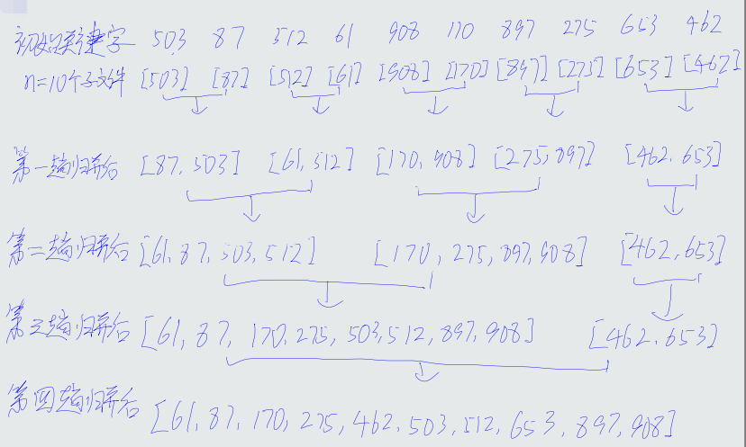

## 单选

1-5 ABAAA

6-10 CADBD

11-15 BDCBD

## 判断

1-5 FFFFF

6-10 FFTFT

11-15 TTTFT

## 填空

1、表示在最糟糕的情况下，执行一段代码的时间复杂度

2、0x11ff8c

3、不一定

4、O(n)

5、n-i+1

6、链头

7、O(n)

8、1140

9、6

10、5

11、CEDBA

12、108

13、n^2-e

14、n(n-1)

15、2

## 问题求解

1

- CDEBA
- CDBEA
- CDBAE

2

(1)
$$
m^{i-1}
$$
(2)
$$
⌊\frac{i-1}{m}⌋+1
$$
3

4

共四种

5

6

## 算法设计

1

① p = L->next

② p != NULL

③ p->next = L->next

④ L->next = p

⑤ p =q

2

① top != -1 || p != NULL

② ++top

③ p->lChild

④ top--

⑤ p->rChile

3

① A.vertexNum

② A.arcNum

③ i

④ B.adjlist.link = NULL

⑤ p->adjvex = j

⑥ p->next = B.adjlist[i]

⑦ B.adjlist[i].link = p

⑧ p->adjvex = i

⑨ p->next = B.adjlist[j]

⑩ B.adjlist[j].link = p
