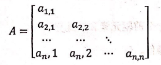

## 单选（2/30）

1.算法的时间复杂度与（）有关

- A.问题规模
- B.计算机硬件的运行速度
- C.源程序的长度
- D.编译后执行程序的质量

2.向一个有 n 个元素的顺序表中插入一个新元素并保持原来顺序不变，则平均要移动（）个元素

- A.n
- B.n/2
- C.2n
- D.n2

3.设指针变量p指向单链表中结点 A，若除单链表中结点 A，则需要修改指针的操作序列为（）

- A.q=p->next; p->data=q-data; p->next=q->next; free(q);
- B.q=p->next; q->data=p->data; p->next=q->next; free(q);
- C.q=p->next; p->next=q->next; free(q);
- D.q=p->next; p->data=q->data; free(q);

4.双向链表中有 2 个指针域 pre 和 next，分别指向直接前驱和直接后继，假设有指针 p 指向链表中的一个结点，指针 q 指向一个待插入的结点，则正确的在结点 p 之前插入结点 q 的语句为（）

- A.p->pre->next=q; q->next=p; q->pre=p->pre; p->pre=q;
- B.p->pre=q; q->next=p;q-pre-p-pre;p->pre=q;
- C.q->pre=p->pre; p->pre->next=q; q->next=p; p->pre=q->next;
- D.q-next=p; p->next=q; p->pre->next=q; q->next=p;

5.已知栈的最大容量是 4，若进栈顺序为 ABCDEF，则可能的出栈顺序列为（）

- A.CBEDAF
- B.BCEFAD
- C.ADFEBC
- D.EDCBAF

6.循环队列存储在数组`A[0...m]`中，入队时的操作为（）

- A.rear = rear+1

- C.rear = (rear+1) % (m+1)
- B.rear = (rear+1)% m
- D.rear = (rear+1) %(m-l)

7.假设用数组A[50]存放循环队列元素，头尾指针 front 和 rear，front=13， rear=5 时循环队列中元素的个数为（）

- A.42

- B.8
- C.43
- D.9

8.设串 s1=“ABCDEFG”，s2=“PQRST” 函数 Con(x, y) 返回 x 和 y 串的连接串，函数 Subs(s, i, j) 返回串 s 的从序号 i 开始的 j 个字符的子串，len(s) 返回串 s 的长度，则 Con(Subs(s1, 2, len(s2)), Subs(s1, len(s2), 2))的结果串是（）

- A.BCDEF
- B.BCDEFG
- C.BCPORST
- D.BCDEFEF

9.设矩阵A是一个对称矩阵，为了节省存储，将其下三角部分(如图所示)按行序存放在一维数组`B[1...(n-1)/2]`中，对下三角部分中任一元素`a[i][j] (i<j)`，在一维数组 B 中下标 k 的值是（）

- A.i(i-1)/2+j-1
- B.i(i-1)/2+j
- C.i(i+1)/2+j-1
- D.i(i+1)/2+j

10.假设一个电报使用 5 种字母组成，字母出现频率分别为 2、4、57、8，用这 5 个字母设计的哈夫曼树带权路径长度为（）

- A.10
- B.96
- C.84
- D.58

11.一个完全二叉树的第 6 层有 9 个叶子结点，则这颗二叉树最多有多少个结点（）

- A.41
- B.109
- C.40
- D.119

12.带权有向图 G 用邻接矩阵 A 存储，则顶点的入度等于 A 中（）

- A.第i行非0的元素之和
- B.第i列非0元素之和
- C.第i行非无穷且非0元素的个数
- D第i列非无穷且非0元素的个数

13.设 N 个点 E 条边的图用邻接表存，则求每个顶点入度的时间复杂度为（）

- A.O(N)
- B.O(N^2)
- C.O(N+E)
- D.O(N*E)

14.对序列 (15，9，7，8，20，1，4) 用快速排序方法升序排序，经过一趟排序后序列为（）

- A.9，7，8，4，1，15，20
- B.4，9，7，8，1，15，20
- C.1，9，7，8，4，15，20
- D.以上都不对

15:对包含 n 个元素的散列表进行查找，平均查找长度（）

- A.为 O(logn)
- B.为 O(n)
- C.与 n 无关
- D.与装填因子有关

## 判断（1/15）

1.运算的定义依赖于逻辑结构，运算的实现也依赖于逻辑结构而与存储结构无关（）

2线性表的各种基本运算在顺序存储结构上的实现均比在链式存储结构上的实现效率要低（）

3.线性表中的所有元素都有一个前驱元素和后继元素（）

4.删除栈底元素是栈的基本操作（）

5.队列和栈都是运算受限的线性表，只允许在表的两端进行运算（）

6.设串 S 的长度为 n，则 S 的子串个数最多为 n(n+1)/2（）

7.给定串 S1和 S2 的度分别为 n、m，则针对 S1、S2 使用布鲁特-福斯算法在最好情况下的时间复杂度为 O(n+m)（）

8.在完全二叉树中，叶子结点的双亲的左兄弟(如果存在)一定不是叶子结点（）

9.完全二叉树中不适合顺序存储结构，只有满二叉树适合顺序存储结构（）

10.在完全二叉树中，若一个结点没有左孩子，则它必是叶子结点（）

11.在一个图中，所有顶点的度数之和等于所有边的数目的 2 倍（）

12.所有边的权值都不相同的带权无向图的最小生成树是唯一的（）

13.在一个有向图中，所有顶点的入度之和等于所有顶点的出度之和（）

14.二分查找中，表必须有序，表可以顺序方式存储，也可以链表方式存储（）

15.若在散列表中删除一个元素，不能简单地将该元素删除（）

## 填空（2/30）

1.在最坏情况下的时间复杂度是（）

2.一个顺序表的第一个元素的存储地址是 0xl1f7c每个元素的长度为 4，则第 5 个元素的地址是（）

3.单链表中逻辑上相邻的元素，其物理位置（）相邻

4.线性表 (a1, a2...an) 以单链表方式时，访第 i 个位置的素的时间复度为（）

5.若一个的输入序列是 123...n，输出的第一个是 n，则第 i 个输出元素是（）

6.在用单链表实现队列时，队头在链表的（）位置

7.假设循环单链表表示的队列长度为 ，队头固定在链表表尾，若只设头指针，则入队操作的时间复杂度为（）

8.数组`A[1...5][1...6]`的每个元素占 5 个单元，将其按行优先顺序存储在起始地址为 1000 的连续内存单元中，则元素 `A[5][5]` 的地址为（）

9.设目标T=“abccdcdccbaa”，模式 P=cdcc”，则第（）匹配成功

10.假定一颗度为 3 的树中结点数为 50，则其最小高度为（）

11.已知一颗二叉树的后序历序列为 DABEC，中序遍历序列为 DEBAC，则先序遍历序列为（）

12.一颗哈夫曼树共有 215 个结点，对其进行哈夫曼编码，共能得到不同的码字数量为（）

13.一个具有 n 个顶点e条边的有向图的邻接矩阵中，零元素的个数为（）

14.具有 n 个顶点的有向图最多可包含的有向边的条数是（）

15.已知一个有序表 (13，18，24，35，47，50，62，83，90，115，134)，当二分查找值为 90 的元素时，查找成功的比较次数为（）

## 问题求解（45）

