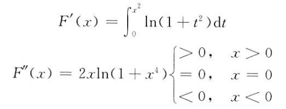
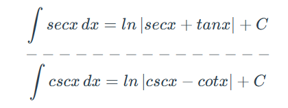
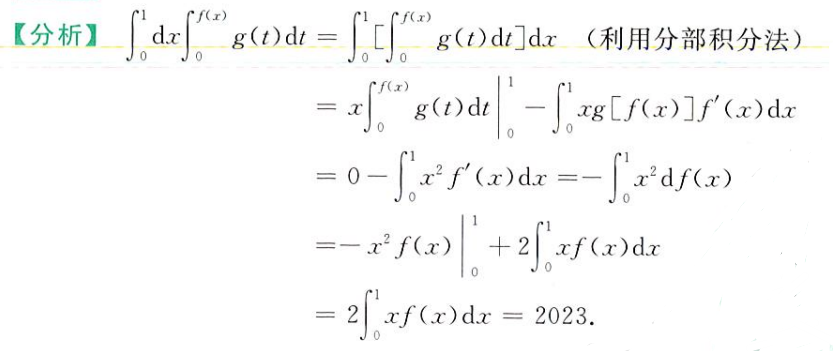
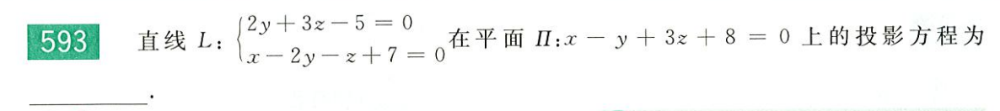
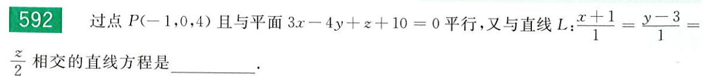
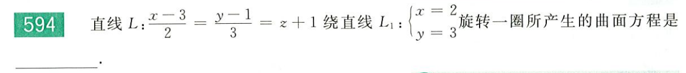

> 一些遗漏的习题：T48、54、60~64、65、67~71

## 极限求解

### 数列、函数极限求解

就是一些常规方法：指、对、洛、等价（泰勒展开）

但要注意化简问题，如对于带根号的分式求极限，首先一定要考虑分子/分母有理化

对于数列，有时还有数学归纳法和放缩法的运用

### 泰勒展开求极限

> 泰勒展开的本质：通过 +/- 项使多项式逼近原函数

泰勒展开举例：就是对部分项展开，化简多项式，然后正常求极限

1、栗子一，对于下列极限
$$
\lim_{x\rightarrow+\infty}\frac{(1+\frac{1}{x})^{x^2}}{e^x} =
\lim_{x\rightarrow+\infty}\frac{e^{x^2ln(1+\frac{1}{x})}}{e^x} =
\lim_{x\rightarrow+\infty}e^{x^2ln(1+\frac{1}{x})-x}
$$
对于指数部分
$$
x^2ln(1+\frac{1}{x})
$$
有泰勒展开
$$
\lim_{x\rightarrow0}ln(1+x) = x-\frac{x^2}{2!}+...
$$
所以有
$$
\lim_{x\rightarrow0}ln(1+\frac{1}{x}) = \frac{1}{x}-\frac{1}{2x^2}+o(x^{-2})
$$
进一步有
$$
x^2ln(1+\frac{1}{x}) - x = x - \frac{1}{2} - x = -\frac{1}{2} 
$$
故极限为
$$
e^{-\frac{1}{2}}
$$
2、再举一个栗子
$$
\lim_{x\rightarrow0}\frac{ax^2+bx+1-e^{x^2-2x}}{x^2} = 2
$$
对于
$$
e^{x^2-2x} \Rightarrow 1+(x^2-2x)+\frac{(x^2-2x)^2}{2}+o(x^2)
$$
只留小于等于 x 平方的项（更高阶的无穷小对于分母 x 方将等于 0），得
$$
e^{x^2-2x}= 1+3x^2-2x+o(x^2)
$$
故原式可化为
$$
\lim_{x\rightarrow0}\frac{(a-3)x^2+(b+2)x}{x^2} = 2
$$
所以有`a-3 = 2, b = -2`（x 前的系数一定要为 0，否则极限将为无穷）

## 连续、可导和可积

### 可导条件

> T153

可导的两要素：连续（极限）、左右导数（连续不一定可导，可导一定连续）

连续不一定可导：连续指函数值连续，可导指函数导数连续（左右导数相等）

f(x) 连续，一定有 |f(x)| 连续，反之不成立
$$
f(x) 连续\Rightarrow |f(x)|连续
$$
f(x) 可导，一定有 f(x^2) 可导，反之不成立，后者相当于前者的右导数
$$
f(x) 可导\Rightarrow f(x^2)可导
$$
f(x) 可导，|f(x^2)| 不一定可导

### 可积条件

> T176、177、179、180、181

可积的三要素：连续、有界、间断点（可积不一定连续，连续一定可积）

可积的条件

- 充分但不必要：连续
- 充要：函数在范围内有界且在范围内间断点有限

如对于无界函数
$$
f(x) = 
\begin{cases}
tanx, x\in(-\frac{\pi}{2},\frac{\pi}{2})\\
0,\,x=\pm\frac{\pi}{2}
\end{cases}
$$
显然 tanx 在区间内无界，直接判死刑，不可积

如对于不连续函数
$$
f(x) = sgn\,x = 
\begin{cases}
1,\,x>0\\
0,\,x=0\\
-1,\,x<0
\end{cases}
$$
显然可积，所以不连续不一定不可积

还有，不可积的函数线性加上可积函数的复合函数，一定不可积，基于上述性质很容易理解

## 积分求导

### 一元积分导数

一元积分求导
$$
\int_0^{x^2}f(2u-1)du
$$
先进行换元，注意换限
$$
\frac{1}{2}\int_0^{x^2}f(2u-1)d(2u-1) = \frac{1}{2}\int_{-1}^{2x^2-1}f(t)dt
$$
最后再进行求导，对于复合限，一定要链式求导，常数限不用管（导为 0，消失了）
$$
[\,\frac{1}{2}\int_{-1}^{2x^2-1}f(t)dt\,]’ = \frac{1}{2}f(2x^2-1)4x
$$
### 二元积分偏导

积分偏导
$$
g(xy) = \int_1^{xy}f(t)dt
$$
则有
$$
\frac{∂f}{∂x} = f(xy)\,y
$$

### 连续积分求导

> T193

对于二重积分
$$
\int_0^x(\int_0^{u^2}ln(1+t^2)dt)du
$$
有

### 导函数和原函数的联系

定理一：导函数 f(x) 若在 (a, b) 内连续，则原函数 F(x) 一定在 (a, b) 内可导且导数等于 f(x)

这里有点怪，既然已经知道了导函数，为什么还要说原函数有可能不可导呢？主要是由于区间限制，如
$$
f(x) = \begin{cases}
\sqrt{4+x}&x>0\\
0&x=0\\
\sqrt{1-x}&x<0
\end{cases}
$$
在各自区间内，均可以积分得到原函数 F(x)，注意这里大于 0 和小于 0 的区间均开口，也就是说这两个区间内对应的原函数，根本不管 0 这个点的是否可导，而是**通过分段的方式令其强行导函数值存在**

故实际上 F(x) 在 x = 0 处左右导数并不相等，故该点不可导，只是对他的导函数 f(x) 进行了手动的分段处理，强行使 x = 0 处函数值相等

或者根据定理一也可以做出判断

这里 f(x) 在 x<0 和 x>0 的区间内均连续，所以在各自区间内一定有 F'(x) = f(x)，于是

F(x) 有右导数
$$
F'_+(0) = f_+(0) = \lim_{x\rightarrow0^+}f(x) = \sqrt{4+0^+}=2
$$
左导数
$$
F'_-(0) = f_-(0) = \lim_{x\rightarrow0^-}f(x) = \sqrt{1-0^-}=1
$$
故 F(x) 在 x = 0 处左右导数不等，不可导

## 极值点和拐点的判定

极值点和拐点的判定从来不是等于 0，而是导函数正负号的突变，如在间断点 x0 左边导函数 f(x) 小于零，右边 f(x) 大于零，那么 x0 就是一个 F(x) 的极小值点（而这个点根本就没有定义）

从表面来看，拐点的判定有以下特征

- 从原函数来看，其凹凸性发生突变
- 从一阶导函数来看，原函数的拐点为一阶导的一个极值点
- 从二阶导函数来看，在拐点左右其正负值发生突变（根本原因）

一定要抓住：**正负值突变是取极值或拐点的本质原因，而间断点和极值点/拐点并没有必然联系，导函数为 0 和极值点/拐点也没有必然联系**

## 不定积分和定积分

### 积分大小判定和中值定理

> T184、185

考虑被积函数的大小，结合中值定理
$$
(b-a)f(\xi) = \int_a^bf(x)dx\quad \xi\in(a,b)
$$
比如对于函数
$$
f(x) = \frac{sinx}{x}\quad x\in(0,\frac{\pi}{2})
$$
根据导函数
$$
f'(x) = \frac{xcosx-sinx}{x^2} < 0
$$
可知，其最小值取在区间的末尾，即
$$
f_{min}(x) = f(\frac{\pi}{2}) = \frac{2}{\pi}
$$
故积分根据中值定理，一定满足
$$
\int_0^{\frac{\pi}{2}}f(x)dx \geq (\frac{\pi}{2}-0)f_{min} = 1
$$
对于这种一眼能看出函数值大于 1 的函数
$$
f(x) = \frac{x}{sinx} > \frac{sinx}{x}
$$
一定有
$$
\int_0^{\frac{\pi}{2}}\frac{x}{sinx}dx > \int_0^{\frac{\pi}{2}}\frac{sinx}{x} \geq 1
$$

### 反常积分的收敛判断

定积分要求

- 积分区间有界
- 被积函数有界

而反常积分即为破坏上述任意一个条件的定积分，分为

- 无穷限积分
- 瑕积分：被积函数在某点无界，该点称为瑕点，如 lnx 在 x=0 处

就是积分，然后判断瑕点是否积分值是否存在（不存在即为趋于无穷），或判断无穷限时，函数值是否存在

### 三角积分

sinx 分之一的积分，通过手动对补一个 sinx，分母通过 1 化为 cosx，分子放在微分符号后面，积为 cosx，然后对这个 cosx 进行拆分，并进行对数积分，得到结果

- cosx 是对 sinx 对数积分，分子为 +，分母为 -
- sinx 是对 cosx 对数积分，分子为 -，分母为 +

别忘了系数 1/2

等价于

根号下三角函数处理，通过倍角公式消去 1 以及用平方抵消根号
$$
\sqrt{1-cosx} = \sqrt{1-(1-2sin^2\frac{x}{2})} = \sqrt2sin\frac{x}{2}
$$

举个栗子

### 常见积分技巧

#### e 的 y 次方的积分次序交换

对于二重积分
$$
\int_0^1dx\int_x^1e^{y^2}dy
$$
这个 y 方根本分部不掉，考虑积分域，x/y 进行对换，可得
$$
\int_0^1dy\int_0^ye^{y^2}dx
$$
这样就可以啦

#### 巧用分部积分

对一个二重积分使用分部积分

## 微积分物理应用

### 参数方程旋转体

旋转体体积求解，其实和普通方程一样，普通方程公式为
$$
\pi\int_a^b y^2dx
$$
其中 (a,b) 为自变量 x 的取值范围

化为参数方程即为
$$
\pi\int_{t_1}^{t_2}y^2(t)\,dx(t)
$$
其中上下限为 t 的取值范围，微分符号后的 x(t) 需要手动导出来，令自变量为单纯的参数 t

旋转体面积求解，首先要明确弧长公式
$$
s = \int\sqrt{x'(t)^2+y'(t)^2}dt
$$
对于旋转体的圆形切片周长（圆柱的底面周长）在弧上积分可得其表面积
$$
2\pi\int|y(t)|\sqrt{x'(t)^2+y'(t)^2}dt
$$
注意这里的表面积，在实际求解中，是将内外表面积相加，若两个函数分别为上下限，则要分别求其表面积（内外），再相加

### 梯度和方向导数

对于一个多元函数，其梯度为各偏导组成的一维向量，如
$$
f(x,y) = x^2+2x+y^2+y+1
$$
其有偏导
$$
\frac{∂f}{∂x} = 2x+2\quad \frac{∂f}{∂y} = 2y+1
$$
故其梯度为
$$
grad(f) = [2x+2,\,2y+1]
$$
代入具体点位，可得
$$
grad(f)_{|(1,1)} = [4, 3]
$$
对于方向（一个一维向量）
$$
l = [1,7]
$$
则有方向导数
$$
grad(f) \cdot l^T = 2x+2+14y+7 = 2x+14y+9
$$
代入任意点位，如 (1,2)，其有关于 l 的方向导数为 39

### 质心

在二维坐标系下，一个图形的质心的横坐标为
$$
\overline{x} = \frac{\int x(t)\sqrt{x'(t)^2+y'(t)^2}dt}{\int\sqrt{x'(t)^2+y'(t)^2}dt}
$$
纵坐标为
$$
\overline{y} = \frac{\int y(t)\sqrt{x'(t)^2+y'(t)^2}dt}{\int\sqrt{x'(t)^2+y'(t)^2}dt}
$$

## 空间解析几何

### 内积和叉积

当两向量垂直（其夹角为 90°），二者的叉积的模长等于两向量模长之积
$$
|c| = |a|\,|b|\,sin<a,b>
$$

举个栗子

此时已知 a、b、c 两两垂直，且
$$
|a| = |b|\,|c|\quad |c|=|a|\,|b|\longrightarrow |a|=|a|\,|b|^2 \Rightarrow |b| = 1
$$
故`|a|+|b|+|c| = 1+1+1 = 3`

用内积可以求两直线夹角
$$
ab=|a|\,|b|\,cos<a,b>
$$
点积结果等于两向量模长乘积乘以夹角的cos值

### 求解投影

对于平面来说，其法向量就是各未知数前系数所组成的向量，如
$$
ax-by+cz+d = 0\Rightarrow \mathop{n}^{\rightarrow}=(a,-b,c)
$$
对于用两个平面方程表示的直线（直线的交线形式），其有方向向量
$$
\begin{cases}
2y+3z-5=0\\
x-2y-z+7=0
\end{cases}
\Rightarrow
\mathop{s}^{\rightarrow}=
\left | \begin{matrix}
i&j&k\\
0&2&3\\
1&-2&-1
\end{matrix} \right |
= (4,3,-1)
$$
对于直线的点斜式，其方向向量自然等于其系数向量，如
$$
L:\frac{x+1}{1}=\frac{y-3}{1}=\frac{z}{2}\Rightarrow\mathop{s}^{\rightarrow}=(1,1,2)
$$
注意当直线的方向向量和平面的法向量垂直（内积为 0），有直线平行于平面

通过直线的方向向量和平面的法向量，可以做出一个垂直于平面的新平面

- 通过方向向量和原平面法向量叉积求出新平面的法向量
- 再通过直线上一点列出平面方程

这里新平面和原平面的交线，也就是直线在原平面上的一个投影，当然可以用新旧两平面交线形式表达出来

通过 L 方程可求其方向向量
$$
\mathop{s}^{\rightarrow}=
\left | \begin{matrix}
i&j&k\\
0&2&3\\
1&-2&-1
\end{matrix} \right |
= (4,3,-1)
$$
过这个方向向量和平面 Ⅱ 的法向量，可以确定一个过直线 L 的垂直于平面 Ⅱ 的平面，记为平面 Ⅰ，平面 Ⅰ 的法向量一定满足
$$
\mathop{s}^{\rightarrow}=
\left | \begin{matrix}
i&j&k\\
4&3&-1\\
1&-1&3
\end{matrix} \right |
= (1,-2,-1)
$$
过 L 上一点 P(0,4,-1)，可得平面 Ⅰ 方程
$$
x-2(y-4)-(z+1)=0\Longrightarrow x-2y-z+7=0
$$
已知 L 在平面 Ⅱ 的投影即为平面 Ⅰ 和平面 Ⅱ 的交线，故投影 L' 为
$$
L'=\begin{cases}
x-2y-z+7=0\\
x-y+3z+8=0
\end{cases}
$$

### 法向量、方向向量和平行平面

求解与某平面平行且与某直线相交且过某点的直线方程

求解步骤如下

- 过点 P 做平面 Ⅰ 的平行平面 Ⅱ，易知 Ⅱ 上任何直线均平行于 Ⅰ
- 只要在 Ⅱ 上找到一条过 P 和 L 的直线，即为题目所求
  - 先要找到直线 L 和平面 Ⅱ 的交点 Q
  - 通过直线上两点，即 P 和 Q，写出直线方程

Ⅱ 方程可以直接写出
$$
3(x+1)-4y+(z-4) = 0\Longrightarrow 3x-4y+z+1=0
$$
联立 Ⅱ 方程和直线 L 方程可得交点 Q(15,19,32)，通过两点作直线方程
$$
k=(15+1,19-0,32-4)=(16,19,28)
$$
故通过方向向量和经过的点 P，可以写出所求直线方程 L'
$$
L':\frac{x+1}{16}=\frac{y}{19}=\frac{z-4}{28}
$$

### 空间中两点直线方程

已知 P Q 两点为
$$
P(a_1,b_1,c_1)\quad Q(a_2,b_2,c_2)
$$
则直线 PQ 可表示为
$$
\frac{x-a_1}{a_2-a_1}=\frac{y-b_1}{b_2-b_1}=\frac{z-c_1}{c_2-c_1}
$$
直线平行于平面，其斜率一定相等，若还已知一点，则可通过点斜式写出直线方程

### 求解旋转体方程

总体来说，是一个设原点，根据旋转特性列方程，消除原点未知数的过程

设 L 上任意一点`P(x0,y0,z0)`，经旋转后到达点`Q(x,y,z)`，二者坐标一定满足
$$
\begin{cases}
z_0=z\\
(x_0-2)^2+(y_0-3)^2=(x-2)^2+(y-3)^2
\end{cases}
$$
另外因为 P 在直线 L 上，所以必有
$$
\frac{x_3-3}{2}=\frac{y_0-1}{3}=z_0+1
$$
联立两个方程组消去`(x0,y0,z0)`即得关于`(x,y,z)`坐标满足的方程，即为所求曲面方程
$$
x^2+y^2-13z^2-4x-6y-18z+3=0
$$

### 点到平面距离

对于平面`ax + by + cz + d = 0`和点`(x,y,z)`，其距离为
$$
d=\frac{|ax+by+cz+d|}{|n|}\quad |n|=\sqrt{a^2+b^2+c^2}
$$
空间中球的方程，圆心为`(a,b,c)`，半径为`r`
$$
(x-a)^2+(y-b)^2+(z-c)^2=r^2
$$
和平面上相类似

### 求解标准平面上的柱面

就是把曲线的某一个自变量消掉，如把 z 消掉，即为在 xOy 平面上的柱面方程

直接通过第二个平面方程
$$
z = \frac{x+3}{2}
$$
把第一个平面中 z 消掉，得
$$
\frac{x^2}{16}+\frac{y^2}{4}-\frac{(x+3)^2}{2^2\times5}=1
$$
化简得
$$
x^2+20y^2-24x=116
$$
故选 A

### 共面、平行和重合

