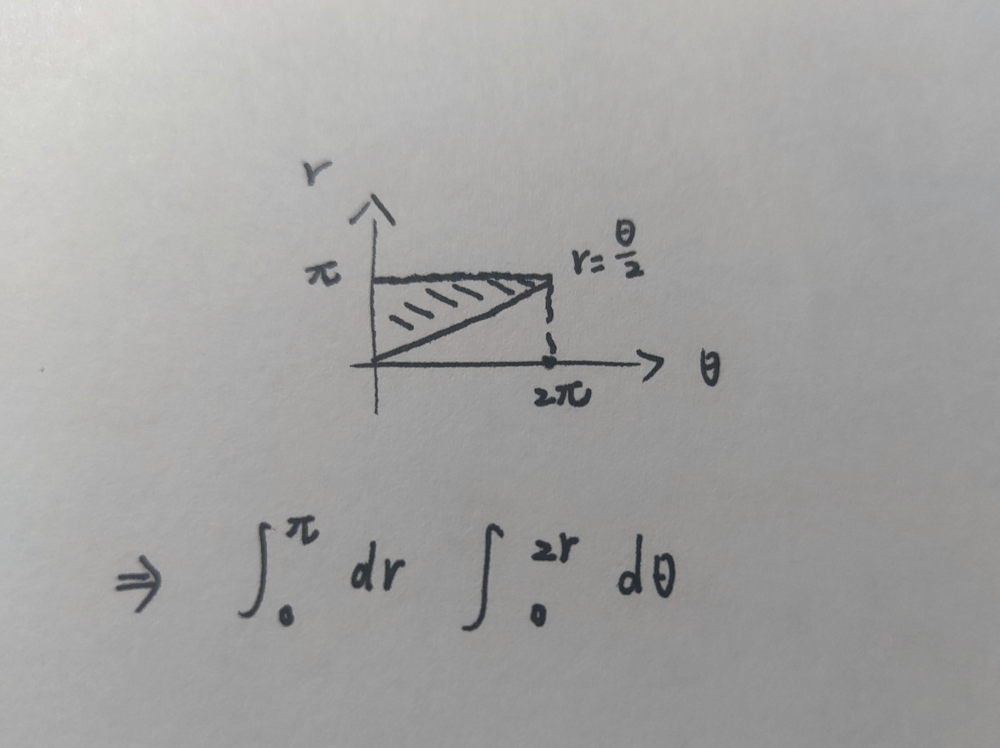

## 函数、极限、连续

我发现有些时候部分替换，再洛去求极限并不影响最后结果，或许是因为这里的替换刚好符合泰勒的二阶展开，即原式二阶展开即可化简，三阶及以上在当前式子中被略去，就相当于用一个泰勒展开去求解极限了

提公因子处理多项式

直接提，将无穷大提为 0
$$
\frac{x^2-xsinx}{x^2+xsin\frac{1}{x}}=\frac{1-\frac{1}{x}sinx}{1+\frac{1}{x}sin\frac{1}{x}}\Longrightarrow1(x\rightarrow\infty)
$$
提指数，将某一指数提为常数，有时需要先化为指数
$$
e^{x^2}-e^{2-2cosx}=e^{2-2cosx}(e^{x^2-2+2cosx}-1)\Longrightarrow x^2-2+2cosx(x\rightarrow0)
$$
提对数，当减法中存在不好化的对数，全化为对数，将减法变为除法
$$
ln(sin^2x+e^x)-x=ln(sin^2x+e^x)-lne^x=ln(1+\frac{sin^2x}{e^x})
$$
分类讨论的思想，这在很多时候都适用，简单有效

对于这样的极限
$$
\lim_{x\rightarrow+\infty}x^2[arctan(x+1)-arctanx]
$$
首先就应该想到中值定理来处理`arctan(x+1)-arctanx, x->∞`，令之为
$$
\frac{(arctanx)'_{x=\xi}}{(x+1)-x}=\frac{1}{1+\xi^2}\quad\xi\rightarrow+\infty
$$
故上述极限等价于
$$
\lim_{x\rightarrow+\infty}\frac{x^2}{1+x^2}=1
$$

## 一元函数微分

### 反函数

反函数的导数
$$
g'(y)=\frac{1}{f'(x)}\quad g''(y)=\frac{dg'(y)}{dy}=\frac{dg'(y)}{dx}\frac{dx}{dy}=\frac{-f''(x)}{f'(x)^2}g'(y)
$$
每次求导均是对 y 微分，通过乘以 dx/dx 的方式，统一转化为对 x 的微分，当然，在已知表达式的时候，将因变量换为 x 且用 y 表示，直接对 y 求导也行，但大多时候反函数表达式不好求

### 构造函数

对于一阶导数 f'(x) 有
$$
f'(1)=1\quad f'(x)↓
$$
这样的式子，常常通过构造函数的方式讨论他的正负，如
$$
g(x)=f(x)-x\Longrightarrow g'(x)=f'(x)-1
$$
因为 f'(x) 递减，所以有
$$
\begin{cases}
g'(x)>0\quad x<1\\
g'(x)<0\quad x>1
\end{cases}
$$
故 x=1 是 g(x) 的一个极大值点，故
$$
g(x)\leq g(1)\Longrightarrow f(x)-x\leq0\iff f(x)\leq x
$$
且在 x=1 处取等

## 一元函数积分

### 弧长公式

极坐标函数的弧长计算公式
$$
s = \int_{\theta_1}^{\theta_2}\sqrt{r^2+r'^2}d\theta
$$
### 反常积分判敛

反常积分收敛的判定：一定不要忘了考虑积分区间内的瑕点，不能那么积大哥
$$
\int_{-1}^1\frac{dx}{sinx}
$$
这个反常积分就是发散的，因为在 x=0 时被积函数取瑕点，需要分区域积

一个特殊积分的收敛判定
$$
I=\int_1^{+\infty}\frac{1}{x^pln^qx}dx\quad p,q>0
$$
考虑瑕点 x=1 和趋于无穷时的收敛情况，当 x->1 时，有
$$
I_1=\int_1^e\frac{dx}{ln^qx}\sim \int_1^e\frac{dx}{(x-1)^q}
$$
只有当 q < 1 时，这个积分才会收敛（有点像几何级数的收敛性判定）

而对于无穷时，有
$$
I_2=\int_e^{+\infty}\frac{dx}{x^pln^qx}<\int_e^{+\infty}\frac{dx}{x^p}
$$
故当 p > 1 时，积分 I2 收敛，故原积分 I 只有在 p > 1 且 q < 1 时，收敛

### 特殊曲线的极坐标化

双绞线
$$
(x^2+y^2)^2=x^2-y^2\iff r^2=cos2\theta
$$
这里 θ 的取值范围非常讲究，在第一象限区间为`[0, π/4]`，在其余象限关于原点对称，其面积求法遵循公式
$$
S=\frac{1}{2}r^2\Rightarrow s=4\int_0^\frac{\pi}{4}\frac{1}{2}r^2d\theta=2\int_0^\frac{\pi}{4}cos2\theta d\theta
$$
对于那种一眼看不透的定积分，首先考虑到的应该是分部，至少能创造机会，贴合题目，一个有意思的换元
$$
\int_0^{+\infty}\frac{sin2x}{x}dx=\int_0^{+\infty}\frac{sint}{\frac{t}{2}}d\frac{t}{2}=\int_0^{+\infty}\frac{sint\,dt}{t}
$$
这里由于积分区域正无穷不变，0 也不变，造成直接改动被积函数居然值不变，从直觉上来说我以为值要除以 2

## 空间解析几何

### 点乘和叉乘

叉乘的分配律和交换律

- 分配律和乘法分配律雷同
- 交换律需要添负号
- 注意两平行向量相叉乘为 0（当然包括自身相叉乘）

举个栗子：单位向量 α 和 β 的夹角为 π/6，求解`(α,2β)`和`(3α,β)`为邻边的平行四边形面积为
$$
\begin{aligned}
S=&|(\alpha+2\beta)\times(3\alpha+\beta)|\\
=&|\alpha\times\beta+6\beta\times\alpha|\\
=&|(1-6)(\alpha\times\beta)|=5(\alpha\times\beta)
\end{aligned}
$$
故面积为
$$
S=5|\alpha|\,|\beta|\,sin<\alpha,\beta>=\frac{5}{2}
$$
### 向量投影

投影符号
$$
Prj_cr
$$
表示向量 r 在向量 c 方向上的投影，其值为
$$
|r|\,cos<r,c>=|r|\frac{r\cdot c}{|r|\,|c|}=\frac{r\cdot c}{|c|}
$$

### 直线到直线距离

求直线到直线距离，要转化为直线到平面距离，如
$$
L_1:\begin{cases}
x-1=0\\
y=z
\end{cases}\quad\quad
L_2:\begin{cases}
x+2y=0\\
z+2=0
\end{cases}
$$
对于 L2，可以通过引入变量 λ，设一个过 L2 的平面
$$
\pi:x+2y+\lambda(z+2)=0
$$
令这个平面 π 平行于直线 L1，则 L1 和 L2 的距离便转化为 L1 到平面 π 的距离，代公式算就行

先求 L1 的方向向量和 π 的法向量
$$
s=
\left | \begin{matrix}
i&j&k\\
1&0&0\\
0&1&-1
\end{matrix}\right |
=(0,1,1)\quad n=(1,2,\lambda)
$$
由于 L1 平行于 π，则其方向向量垂直于 π 的法向量，则有
$$
s\cdot n=2+\lambda =0\Rightarrow \lambda=-2
$$
则得到了平面方程
$$
\pi:x+2y-2z-4=0
$$
易得 L1 上一点 P(1,1,1)，故距离 d 为
$$
d=\frac{|1+2-2-4|}{|n|}=\frac{3}{3}=1
$$
### 常用二次曲面

单叶双曲面
$$
\frac{x^2}{a^2}+\frac{y^2}{b^2}-\frac{z^2}{c^2}=1
$$
双叶双曲面
$$
\frac{x^2}{a^2}+\frac{y^2}{b^2}-\frac{z^2}{c^2}=-1
$$
椭圆双曲面
$$
\frac{x^2}{a^2}+\frac{y^2}{b^2}=cz
$$
双曲抛物面（马鞍面）
$$
\frac{x^2}{a^2}+\frac{y^2}{b^2}=cz
$$
不符合上面的考虑旋转双曲面和旋转椭圆面

## 多元函数微分

### 隐函数存在定理

若函数 F 满足下列条件

1. F 在以 P(x0,y0) 为内点的某一区域 D 上连续
2. F(x0,y0) = 0（通常称为初始条件）
3. F 在 D 内存在连续的偏导数
4. 偏导数在 P 点的值不为 0 

如对于连续的函数 F 以及存在的偏导 Fy，若
$$
F(x_0,y_0)=0\quad F_y'(x_0,y_0)\neq0
$$
则此时，隐函数 y(x,z) 被唯一确定

### 通过方程确定隐函数

常见考法，通常会给你两个方程，存在两个隐函数，消去一个隐函数导数得到另一个隐函数的确定导数

一定要注意偏导求法，用下标`1,2...`表示，同时注意链式求导法则，如
$$
f[x,f(x,2x)]'=f_1'+f_2'(f_1'+2f_2')
$$

### 曲面的切平面和法向量

设有曲面
$$
z=x^2+y^2-1
$$
设函数
$$
F=z-x^2-y^2+1
$$
则曲面在 (2,1,4) 的法向量为
$$
(-2x,-2y,1)=(-4,-2,1)
$$
曲面在 P 的切平面为（在 P 点法向量相同）
$$
-4(x-2)-2(y-1)+z-4=0\Rightarrow-4x-2y+z+6=0
$$
曲面在 P 的法线方程为（法向量作为斜率，得到法线）
$$
\frac{x-2}{-4}=\frac{y-1}{-2}=z-4
$$
同理，对于隐函数
$$
z = f(x,y)
$$
设函数
$$
F = z-f(x,y)
$$
则切向量为
$$
(-\frac{∂F}{∂x},-\frac{∂F}{∂y},1)
$$

### 曲线的切向量和法平面

设曲线
$$
\begin{cases}
x^2+y^2=10\\
x^2+z^2=10
\end{cases}
$$
将 y 和 z 视作关于 x 的函数，x 作为整条曲线的自变量，则曲线的切向量为（这和曲面的法向量求法本质是一样的）
$$
(x,\frac{dy}{dx},\frac{dz}{dx})
$$
根据曲线方程两边求导易得
$$
\frac{dy}{dx}=-\frac{x}{y}\quad \frac{dz}{dx}=-\frac{x}{z}
$$
故曲线在 P(3,1,1) 的切向量为
$$
(1,-3,-3)
$$
切线方程为
$$
\frac{x-3}{1}=\frac{y-1}{-3}=\frac{z-1}{-3}
$$
法平面方程为
$$
x-3-3(y-1)-3(z-1)=0\Rightarrow x-3y-3z+3=0
$$

### 保号性和极值定义判断极值点

对于这样的式子
$$
\lim_{x\rightarrow0,y\rightarrow0}\frac{f(x,y)}{x^2+y^2}=k
$$
若 k > 0，由于分母一定大于 0，由于保号性分子一定大于 0，若`f(0,0) = 0`，即有`f(x,y) > 0 = f(0,0)`，则可以根据极值的定义判定 (0,0) 为 f 的一个极小值点（左右两边均大于该点值）

若 k < 0，且`f(0,0) = 0`，则能判定 (0,0) 为极大值点

### 方向余弦和方向导数

对于方向 l
$$
l: (a,b,c)
$$
其方向余弦为，其实就是一个单位化处理，有时需要有时不用
$$
cos\alpha=\frac{a}{|l|}\quad cos\beta=\frac{b}{|l|}\quad cos\phi=\frac{c}{|l|}
$$
而对于任一空间函数 f(x,y,z) 在 l 上的方向导数则为
$$
(\frac{∂f}{∂x},\frac{∂f}{∂y},\frac{∂f}{∂z})\cdot(cos\alpha,cos\beta,cos\phi)^T
$$
其中前者为 f 的梯度，这在求曲线的切线以及平面的法线中常用到

## 重积分

为什么有时候
$$
arcsin(sin\theta)=\pi-\theta
$$
有时候又等于 θ

### 极坐标的代数转化和次序交换

极坐标的代数转化，根据题述的条件，直接将 x 化为 rcosθ，将 y 化为 rsinθ，化简可得 θ 和 r 的取值范围，然后据此列极坐标积分式（在画图不好判断 r 和 θ 范围时可这么操作）

举个简单的栗子，对于被积区间 D
$$
(x-1)^2+y^2\leq1
$$
等价于
$$
x^2+y^2\leq2x
$$
直接用 r 来表示，可得 r 的积分上限：2cosθ
$$
r^2\leq2rcos\theta\Rightarrow r\leq2cos\theta
$$
极坐标的积分次序交换：核心思想，把 θ 和 r 作为直角坐标来处理，即横轴为 θ，纵轴为 r

如对于积分
$$
I = \int_0^{2\pi}d\theta\int_{\frac{\theta}{2}}^\pi\theta^2e^{r^2}dr
$$
其积分区间可画为

故原积分可化为
$$
I = \int_0^{\pi}dr\int_0^{2\pi}\theta^2e^{r^2}d\theta
$$

### 根据 y=x 的对称性简化积分

对于关于 y=x 对称的函数积分，且被积区间 D 关于 y=x 对称，则可以如下处理
$$
I=\iint_D\frac{af(x)+bf(y)}{f(x)+f(y)}dxdy
$$
由于完全 x 完全等价于 y，所以
$$
I=\iint_D\frac{bf(x)+af(y)}{f(x)+f(y)}dxdy
$$
①②式相加可得
$$
2I=\iint_D\frac{af(x)+bf(y)+bf(x)+af(y)}{f(x)+f(y)}dxdy
$$
故最终化简为
$$
I=\frac{1}{2}\iint_D(a+b)dxdy
$$

### 先二后一和先一后二

当被积函数只与 z 有关时，优先考虑先二后一积分，即先积分 x-y 平面，再立体积分，通常这里将伴随平面的极坐标转换，即 x-y 平面被积区间为圆域

先一后二是什莫

## 微分方程

一个细节：积分完成后，尽量保持其原有的形式，不要自作聪明的化简让他似乎更好看，很多时候会不经意的把定义域缩小或增大

### 常用的几种处理方法回忆

伯努利方程：处理高阶指数 y 的方法，同除以 y 的高次幂，作为 dy/dx 的系数，举个栗子
$$
y'-6\frac{y}{x}+xy^2=0
$$
先除以高次幂，化到 y' 的系数位置
$$
y^{-2}y'-6\frac{1}{xy}+x=0
$$
由于
$$
(y^{-1})'=\frac{dy^{-1}}{dx}=-y^{-2}y'\Rightarrow y^{-2}=\frac{-dy^{-1}}{y'dx}
$$
则原式可通过 y' 约为
$$
-\frac{dy^{-1}}{dx}-\frac{6}{x}y^{-1}+x=0
$$
最后换元便得到一个一阶线性微分方程，直接代公式算即可
$$
t = y^{-1}\Rightarrow -t'-\frac{6}{x}t+x=0
$$
齐次：令 t = y/x，进行换元求解

可降阶：一般用于 y'' + f(x)y'= g(x) 的情况，此时将 y' 视作函数 p，则 y'' = p'

### 两个积分式

其实就是拆分，忘了
$$
\int\frac{xdx}{(1+x)^2}=\ln|1+x|+\frac{1}{1+x}
$$
这个有点逆天，应该用三角函数换元能写出来
$$
\int\frac{du}{\sqrt{1+u^2}}=ln(u+\sqrt{1+u^2})
$$

### 不规则换元

> 第七章综合题填空T3、5

根据题目所给的微分方程灵活换元，如
$$
(y^2)'=2yy'\quad (tany)'=ysec^2y
$$
这种题目会有非常明显的暗示，一定要 get 到

### 特殊自由项处理规则

这里在设特解的时候，一定是根据特殊项来设，不需要在意特殊项是否和特征解重合，是否重合只和特解中 x 的指数有关

### 代入法

一般用于以下题型

1. 看特解是否匹配（第七章综合题选择T3）
2. 代入具体值，代入题给方程，求解未知数（第七章综合题选择T4）
3. 代入另一个自变量，悄无声息换元求解微分方程（第七章综合题填空T8）

## 无穷级数

### 判敛和收敛域

正项级数：商判、根判、等价判

交错级数判敛：递减且极限为 0（莱布利兹定理）

积分判敛法：对于级数
$$
\sum_{n=2}^\infty\frac{1}{nlnn}
$$
积分判敛即为，判断其对应的反常积分是否收敛（有界）
$$
\int_2^\infty\frac{dx}{xlnx}=ln(lnx)_{|_2^\infty}\rightarrow+\infty
$$
故原积分发散

### 幂级数

函数的幂级数展开

幂级数的和函数求解

### 傅里叶级数

## 曲线积分和曲面积分

### 第一类曲线积分

第一类曲线积分，就是被积函数在曲线上积分，求解的核心思想是通过投影、参数代换等方法将曲线化为一维积分，如
$$
\oint_L x+y\,ds
$$
其中 y 是一个关于 x 的函数，则这个曲线积分可化为（原被积区间被投影在 x 轴上）
$$
\int_{x_a}^{x_b}(x+y)\sqrt{1+y'^2}dx
$$
若可以将 x 和 y 表示为 t 的函数，则（实际上是将被积曲线投影在了 t 上）
$$
\int_{t_a}^{t_b}(x+y)\sqrt{x'^2+y'^2}dt
$$

### 第一类曲面积分

在曲面上对被积函数求积，和第一类曲线积分一样，核心思想也是降维，将空间曲面投影在平面上，在平面上进行面积分（二重积分）
$$
\oiint_Sx^2+y^2+z^2\,dS
$$
将曲面投影在 xOy 平面上，重点是处理 z 坐标
$$
\iint_D(x^2+y^2+z^2)\sqrt{1+z_1'^2+z_2'^2}\,dxdy
$$
要充分利用**被积区间的对称性**和**被积函数的奇偶性**
