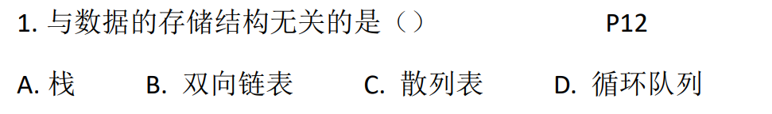
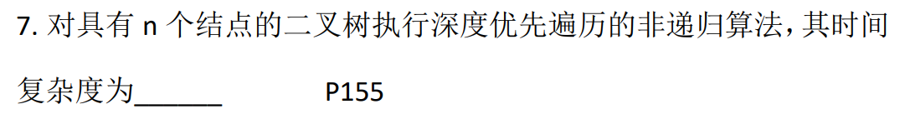
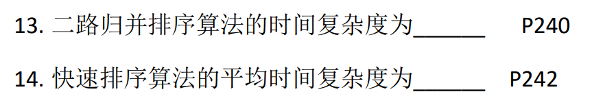
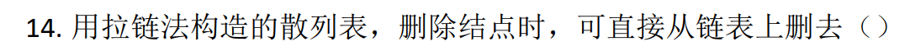
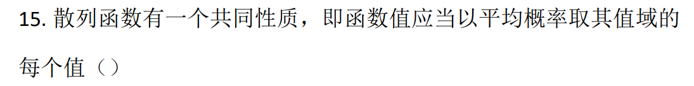
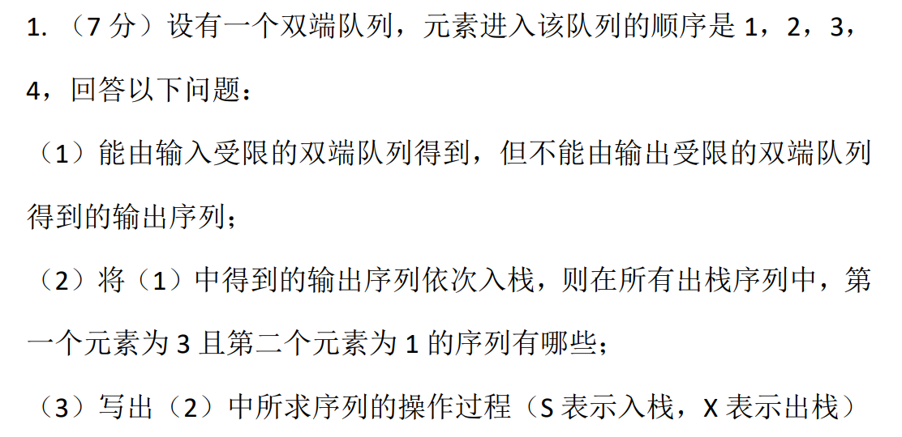
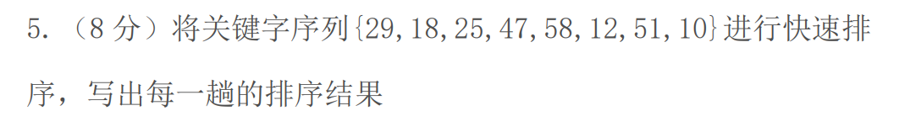
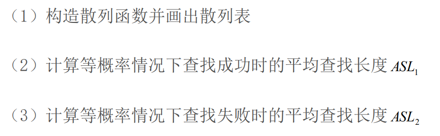

## 模拟卷Ⅰ

### 遗漏知识点

数据的最小单位是：数据项，数据的几种单位

数据结构包含三方面内容：逻辑结构、存储结构和数据的运算

选项中只有栈是逻辑结构，其余都是存储结构，故选 A

子串的定义是严格的相邻串，如`aabc`是`dacdaabcdd`的子串，而`daca`不是子串，c 和 a 被 d 隔开，子串定位运算又叫串的模式匹配

动态规划可用于解决哪些问题？0/1背包问题，硬币找零问题、整数划分问题和背包问题不可被动态规划解决，必须具备最优子结构和子问题重叠这两个特性

图的 DFS 等价于树的什么序遍历？先序

时间复杂度分析：O(n)，O(nlogn)，O(nlogn)

哈希散列删除结点，拉链法可直接删除，而线性探测法不行

函数值应当以等概率取其值域的每个值，而平均概率 ≠ 等概率

稀疏索引：分组建立

### 树的结点、度、高度关系

树的结点数永远比度数多一个：度数 + 1 = 结点数

树的空指针个数永远比结点数多一个：结点数 + 1 = 空指针数

对于二叉树而言有：度为 2 的结点数 + 1 = 度为 1 的结点数（叶子结点数）

- 注意，这里的度数和树的度不是一个概念，度是指最大分叉数，如三叉树的度为 3，m 叉树的度为 m

对于完全二叉树

- 前 n 层的满二叉树结点总数为：2^n-1
- 第 k 层的结点数上限为：2^(k-1)

不妨令 k = n+1，则有第 k 层的结点数上限为前 k-1 层所有结点数之和再加一

### 矩阵的表示方法

三种，三元组表示稀疏矩阵，十字链表法

### 受限队列和栈

我直接把所有可能列举出来一个一个考虑，找到符合（1）的序列 4132

### 折半和快排

折半查找时，可以通过构造一颗平衡二叉树帮助运算，计算其平均查找长度
$$
\frac{\sum高度\times结点个数}{元素个数}
$$
快排的第一步一定是把首尾元素交换，左右指针向中间移动，最后把末尾元素和右指针元素交换回来，在写每轮顺序时一定要细心

排序过程代码，根据严的教材，采用一个独立的 pivot 变量存储当前枢纽，用空位的方式放置指针元素

每个分组中元素的顺序严格按照上面的代码进行，如第一趟

- 初始 left 指向 29，right 指向 10，则直接将 10 写入 29，right 指向的 10 变为空位
- 此时 left 右移，找到第一个大于 pivot 的元素，发现是 47，直接将 47 写入右边的 10 的位置（空位），原 47 处变为空位
- 再左移 right，找到第一个小于 pivot 的元素，12，写入原 47 处，而 12 处变为空位
- 再右移 left，找比 29 大的元素，途中 left 已经大于 right，故将 pivot 写入空位（原 12 的位置），得到一轮排序结果

### 散列表构造

装填因子 α 为关键字数量除以表长（无论是拉链法还是线性探测法均如此），在求解表长时向上取整，散列函数若未给出，除留余数法的模数默认取不大于表长的最大素数（若表长为素数，则模数取表长）

1、已知关键字数量为 11，装填因子 α = 0.75，则表长 L 为
$$
\lceil\frac{11}{0.75}\rceil=15
$$
故模数 P = 13（不大于 15 的最大素数），注意到题目要求用拉链法解决冲突，于是表长实际上**塌陷**为 13

| 0    | 1    | 2    | 3    | 4    | 5    | 6    | 7    | 8    | 9    | 10   | 11   | 12   |
| ---- | ---- | ---- | ---- | ---- | ---- | ---- | ---- | ---- | ---- | ---- | ---- | ---- |
| 26   |      | 41   | 68   |      | 44   | 6    |      |      |      | 36   |      | 38   |
|      |      | 15   |      |      |      |      |      |      |      |      |      | 12   |
|      |      |      |      |      |      |      |      |      |      |      |      | 51   |
|      |      |      |      |      |      |      |      |      |      |      |      | 12   |

2、查找成功平均长度将除以关键字个数，7 个在第一层，2 个在第二岑...
$$
ASL_1=\frac{7\times1+2\times2+3+4}{11}=\frac{18}{11}
$$
3、查找失败平均长度将除以表长，为空则不查找，即查找次数记为 0
$$
ASL_2=\frac{5\times1+2+4}{13}=\frac{11}{13}
$$
