## 2017

### 遗漏知识点

TCP/IP 互联网使用的四层地址 ≠ 多级地址寻址

- 前者分为：物理地址、逻辑地址、端口地址、专用地址（没学过草）
- 后者就是通常理解的：端口寻址、IP 寻址、MAC 寻址

注意一下说法：链路层是点对点，网络层是主机对主机，传输层是端对端（对等实体到对等实体）

无线局域网 802.11 的 MAC 分层：分布式协调功能 DCF 和点协调功能 PCF

采用虚电路交换方式的分组交换网络有：X.25，帧中继，ATM

IPv6 的简写方法

- 0012 简写为 12
- 0000 简写为 0
- pre:0:0:next 简写为 pre::next

对于 s 位的数据，保证检测到 s 种错误，至少需要海明码 s+1 位，保证纠正 s 种错误，至少需要海明码 2s+1 位

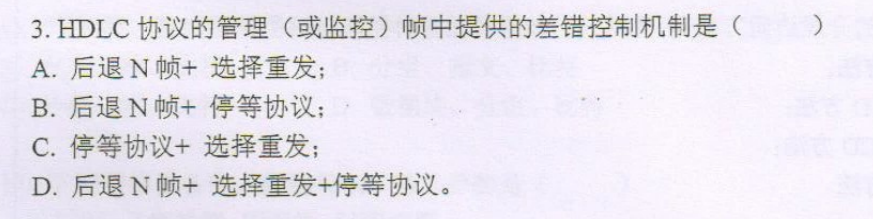

HDLC（高级数据链路控制）：采用后退 N 帧 + 选择重发进行差错控制

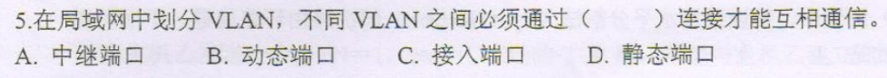

VLAN 通过中继端口相互通信

三层交换机即路由器（通过 IP 转发，MAC 交换），虚电路交换采用虚电路号进行交换，以太网交换机根据 MAC 交换

这里的转发指数据在不同网络中传输，而交换特指在本网络中的数据交换

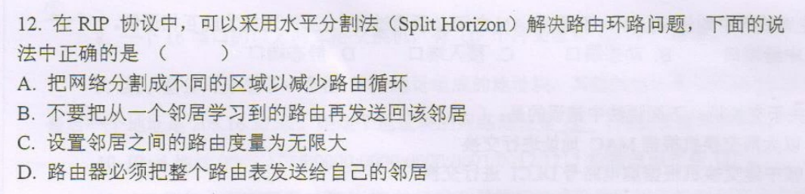

解决路由环路问题：不要把从一个邻居学到的路由发送回该邻居（RIP 采用的是距离-向量算法构造路由表，每次把自身路由表发送给所有邻居，进行路由表更新，OPFS 采用的是洪泛法 + 迪杰斯特拉算法更新路由表）

学到的只有路由器能分割广播域，故只有路由器可以抑制广播风暴

### 简答和计算

IP 分组转发过程可能被修改的首部字段

- TTL、头部校验和、源 IP 地址
- 若 IP 分组的长度超过 MTU，则总长度字段、标志字段、片偏移字段也会改变

多层流量控制

| 层级   | 实现                        |
| ------ | --------------------------- |
| 传输层 | 接收窗口大小控制            |
| 网络层 | ICMP 报文控制               |
| 链路层 | 滑动窗口协议：停等，GBN，SR |

为什么需要多层流量控制？

在多个层进行流量控制的原因是因为 OSI 之间的数据传输，可以看作是在对等实体之间进行的，每一层的对等实体都相对独立，即链路层的流控要求与网络层和传输层的流控要求并不相同，故需要多层流量控制

Web 邮箱登录安全机制

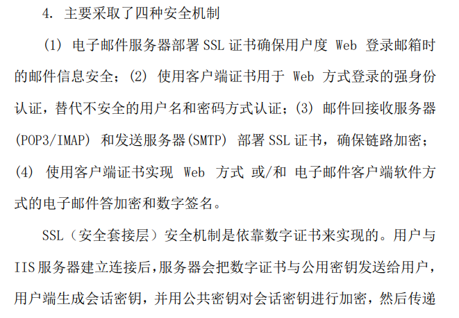

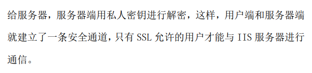

最短帧的判定中，一个 RTT 又被叫做 CSMA/CD 的**冲突窗口**，切记不要理解为滑动窗口中的窗口，这里就是一个时间跨度
$$
\frac{帧大小}{传输速率}\geq 冲突窗口=RTT
$$
有效传输速率，之前写成
$$
\frac{t_1}{t_1+t_2+RTT}\times v
$$
其实这里的`t1 x v` 就等于发送帧的长度，多此一举
$$
\overline v=\frac{L}{t_1+t_2+RTT}
$$

## 2018

### 遗漏知识点

三种传输损伤：失真（中继器）、衰减（放大器）、噪声（信噪比，奈奎斯特定理）

载波监听多路访问存在哪两种问题：隐藏站和暴露站

链路层被划分为哪两个子层：MAC 子层和 LLC 子层，MAC 子层实现和 MAC 帧相关的操作，LLC 子层向上层网络层提供服务

网络层的功能：拥塞控制，路由选择、分组转发、流量控制，连接异构网络

- 拥塞控制的具体算法在传输层 TCP 中有（慢开始、拥塞避免、快重传、快恢复），网络层同样有拥塞控制
- 一定要注意连接异构网络和多址接入的区别，多址接入和物理层多路复用相关（时分、频分），和连接异构网络不是一个概念

VLAN 的划分方式中，静态和动态各有哪些？**802.1Q 协议**，虚拟局域网，其实现基于设备交换机（能隔离广播域，无法隔离冲突域），通过**VLAN标签**实现逻辑分组和管理

- 基于 IP 地址划分
- 基于 MAC 地址划分
- 基于交换机端口划分（静态）
- 基于协议划分

其中只有基于交换机端口的划分是静态的，其余均为动态

冲突域和广播域的隔离情况，冲突域更好隔离

| 物理设备 | 广播域 | 冲突域 |
| -------- | ------ | ------ |
| 集线器   | ×      | ×      |
| 交换器   | ×      | √      |
| 路由器   | √      | √      |

介质访问控制方法，各种局域网中分别使用哪些

- 标准局域网：1-持续的 CSMA-CD
- 无线局域网：CSMA-CA

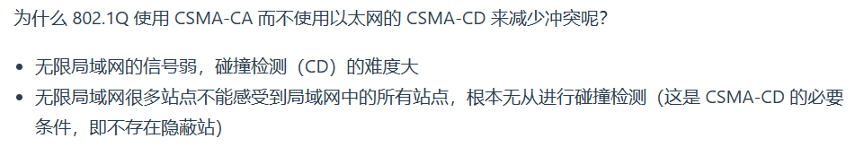

路由表通常的默认路由和掩码是什么？路由 0.0.0.0 和掩码 0（全 0）

IPv4 首部协议字段作用是什么？标注当前分组**荷载字段**承载的是何种协议（不是路由协议也不是应用层协议，更不是下层协议）

子网主机号记住去掉广播地址和网络自身地址，即去掉两个全 1 全 0 地址，如 6 个主机位可表示 64-2 = 62 台主机

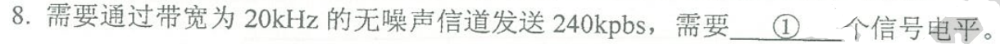

不会写捏

### 简述

OSI 模型和 TCP 模型的异同

ARP 工作过程：先查本网络缓存，若本网络无，通过网关向其他路由器发送请求查寻其他网络，有点像域名系统的递归查询过程（[IPv4-ARP一道栗题](https://northboat.github.io/408/cn/basics/computer-network-ipv4.html#arp-协议)）

使用ARP的四种典型情况，本质上都是为了把 IP 地址转化为 MAC 地址

| 发送方\接收方  | 本网络上某台主机                   | 另一网络上某台主机                                           |
| -------------- | ---------------------------------- | ------------------------------------------------------------ |
| 主机           | 直接用ARP找到目的主机的硬件MAC地址 | 用ARP找到本网络上的一个路由器（网关）的硬件MAC地址。剩下的工作由这个路由器来完成 |
| 路由器（网关） | 直接用ARP找到目的主机的硬件MAC地址 | 用ARP找到本网络上的一个路由器（网关）的硬件地址。剩下的工作有这个路由器来完成 |

OSPF 工作原理和优缺点：使用洪泛法，向网络中所有结点发送自身和相邻结点的距离，通过迪杰斯特拉算法求得各个结点的最短单源路径，实现最优路由选择

RIP 是把自身到所有结点的路由表发送给相邻结点，相邻结点通过这张路由表对自身表项进行更新

### CSMA-CA 计算题

单位转化问题，牢记

| 以秒 s 为例 | 符号表示 | 转换    |
| ----------- | -------- | ------- |
| 秒          | s        | 1       |
| 毫秒        | ms       | 10^(-3) |
| 微秒        | μs       | 10^(-6) |
| 纳秒        | ns       | 10^(-9) |

有时每兆比特每秒，即 Mbit/s 表示为 Mbps（Mbit per second）

CSMA-CA 的传输具体过程及时间计算，主要是第一问，这里一定是忽略中间中转的时间，计算 A 和 C 信号碰撞的时间点，就是说，此时 A 和 C 的第一个比特共同传输了 2000m

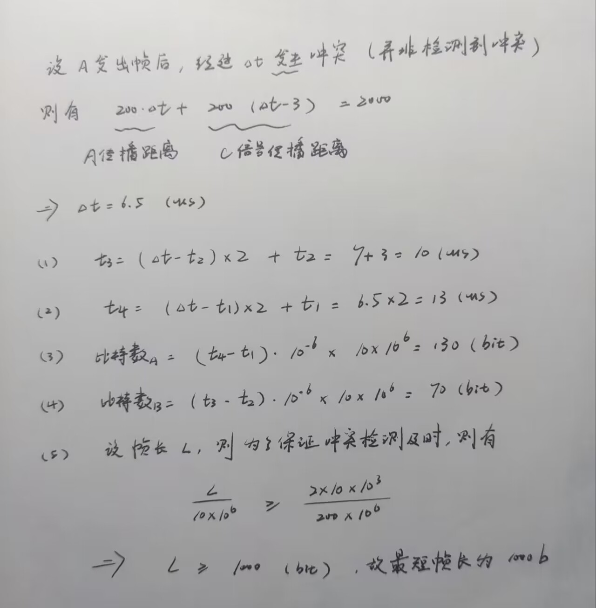

### 编码方式

> 初始时到底怎么处理

| 编码方式     | 英文  | 处理方式                                         |
| ------------ | ----- | ------------------------------------------------ |
| 归零         | RZ    | 高电平为 1，低电平为 0，每次交替先归零           |
| 非归零       | NRZ   | 高电平为 1，低电平为 0                           |
| 反向非归零   | NRZ-I | 翻转表示 0，不翻转表示 1                         |
| 差分曼彻斯特 | \     | 前后半段和后前半段比较，翻转表示 0，不翻转表示 0 |
| 曼彻斯特     | \     | 从低到高表示 0，从高到低表示 1                   |
| 交替反转码   | AMI   | 当为高电平和低电平均表示 1，电平为 0 表示 0      |

**11101110**，我怎么觉得这个答案给的不对呢，这™不是NRZ吗，NRZ-I应该是**01100110**

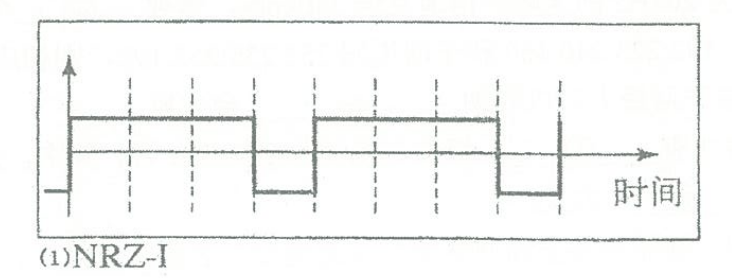

**11000100**（初始给了小半段就是为了判断第一个没变，取 1）

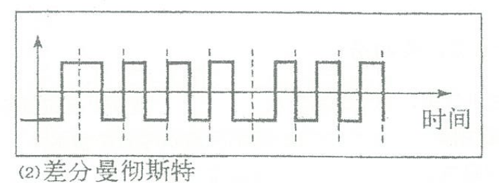

**01110001**

### 滑动窗口的画法

超过位数的编号表示注意取模

- ARQ 方式中：停等是 1 对 1，GBN 是 n 对 1，SR 是 n 对 n
- ARQ 是自动重传请求（Auto Repeat Request），基于确认机制，后两种同时结合滑动窗口机制

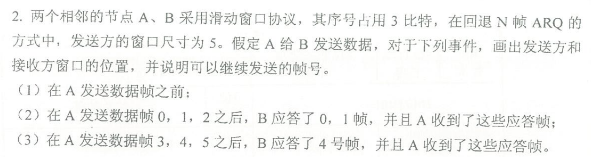

在第二次发送时，由于 2 还未收到确认，所以只能再发送 4 个帧

### 路由表填写

在访问域名服务器这种单一功能的服务器时，其掩码通常使用 all-1 的形式，即 255.255.255.255，以此节省地址空间，而且稍微想一下就可以知道，在只有一个域名服务器的情况下，细分子网毫无意义

为什么访问互联网时使用目的地址 0.0.0.0 掩码 0.0.0.0 进行回环？（T2018.4.5）

当下一跳直接可以到达目的网络时，下一跳 IP 地址表项处直接填写 Direct

子网划分其实可以参考哈夫曼树/编码的扩展步骤，感觉差不多，说实话

### 首部格式综合大题

> 真这么考吗阿Sir

这里实际上是一个以太网帧套PPPOE帧，PPPOE帧套IP分组，IP分组套TCP数据报的一个报文，就是说：最外层是以太网帧首部，以太网帧数据部分为PPPOE帧，PPPOE帧数据部分为IP分组，以此类推

本地注意题目中给到的协议类型 0x8864，可以**快速定位到以太网帧的协议字段**，找到**PPPOE报文的长度字段**和**以太帧的源地址和目的地址字段**，需要注意的是这里没标注的情况下都认为长度的单位是字节，但IP分组中首部长度的单位为4B，总长度单位为1B

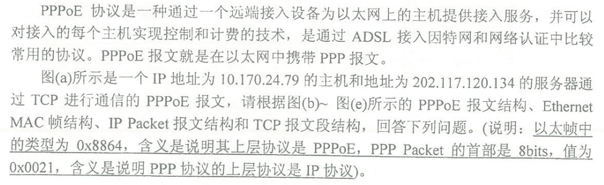

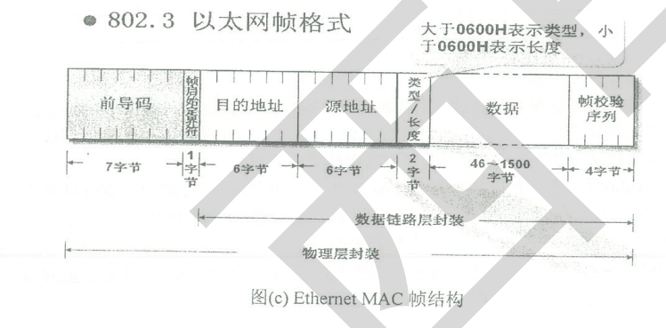

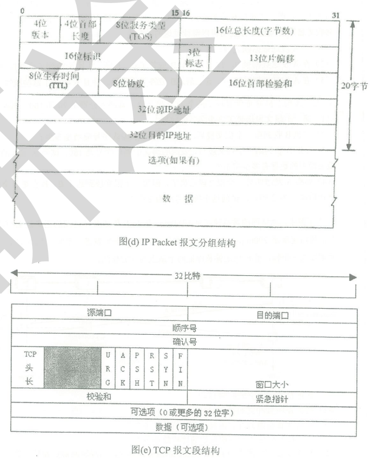

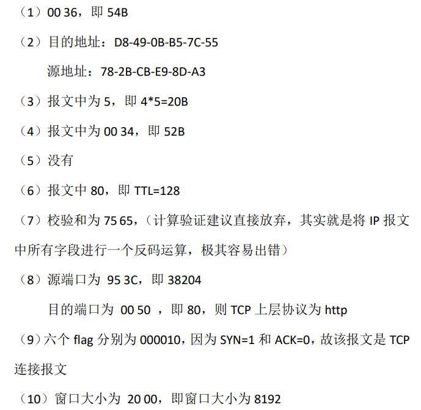

