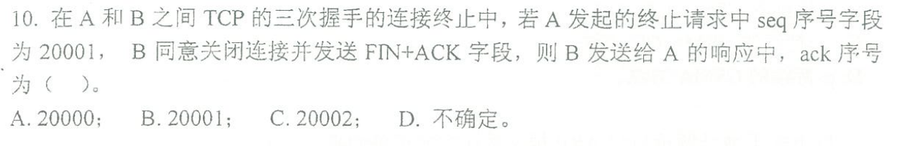
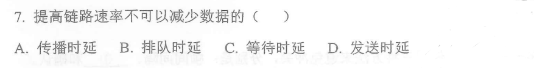

## 2019

 ### 遗漏知识点

采用TCP/IP的互联网使用四层地址分别是：物理（链路）地址，逻辑地址、端口地址、专用地址

奈奎斯特采样定理：为了再生原始模拟信号，采样频率必须大于等于两倍带宽（香农是信噪比，奈奎斯特是 2W）

IEEE 802.11定义了两个MAC子层，分别是：PCF子层和DCF子层。在此之外，链路层分为MAC子层和LLC子层

ARP地址解析请求广播发送，回答报文单播发送，记住

CIDR技术的主要目的是把小的网络汇聚成大的超网，注意他可以把大的网络划分，但不是主要目的，同时不可以解决地址资源不足的问题（IPv6 可以解决）

冲突域比广播域更容易隔绝，已知只有路由器可以隔绝广播域，集线器Hub什么也不能隔离

在TCP建立和释放连接的过程中，回复的报文中的确认号一定是发送过来的报文的序号加一，即`ack = seq+1`，因为这个用于连接/释放的报文默认长度就是 1

### 简答

浏览器访问域名所用协议示例

自动重传请求的三种机制：停等，GBN，SR

- 停止-等待ARQ
- 回退N帧ARQ
- 选择重传ARQ

数据链路层可靠并不代表传输层不需要流量控制和差错控制

CSMA/CD的16字箴言：先听后发，边听边发，冲突停发，随机重发

### 计算

编码回忆，差分曼彻斯特和AMI

### 汉明码和冗余校验码

汉明码

s 个差错对应能够检测所有错误的最小汉明距离为 s+1，保证纠正所有错误的最小汉明距离为 2s+1

CRC 校验码，模2除法

生成多项式到除数b
$$
x^5+x^3+x^2+1\Rightarrow101101
$$
信息补位5位（为除数位数-1）作为被除数：1101101100000

被除数和除数之间做模2除法：最高位对齐，每位上整除则为 0，不整除则为 1，整除包括 0/0 和 1/1

求得的余数 01100 即为 CRC 校验码，在传输时添在原发送信息后，当信息不被除数整除时说明发生差错

### 有效数据传输率计算

在传输帧的时候，确认帧的发送时间不能忽略，最短为 60B

最短收到冲突就是二者同时发送帧，帧共同传输10km的时间，而最大就是一整个来回，即RTT时间

有效数据传输率为
$$
\frac{t_1}{t_1+t_2+RTT}\times C
$$
其中 C 为带宽上的数据传输速率5Mbps，t1、t2分别为发送帧和确认帧的发送时延，确认帧在不提到时默认为60B，即
$$
t_2 = \frac{60\times8\,bit}{5\,Mbps}=96(ms)
$$

### Dijkstra 和最小代价通路树

最小代价通路树是一条从根到叶子的一条完整路径

## 2020

### 遗漏知识点

最早的网络 ARPA-NET，留个印象

选 C

我选的 D，我以为链路速率就是传输速率，但细看会发现 B、C、D 都和发送时延有关，故这里的链路速率约等于带宽，而和传输过程无关，故选 A

典型的数据通信系统的五个组成部分

- **报文**
- 发送方
- 接收方
- 协议
- 传输介质

100Base-TX 以太网选用的物理拓扑结构通常是：星形

- **Base-T 用的是双绞线，拓扑结构为星形**
- Base-5/2 用的是同轴电缆，拓扑为总线
- Base-FL 是光纤，拓扑为点对点

协议的三个核心要素

- 语法：用来规定信息格式；数据及控制信息的格式、编码及信号电平等
- 语义：用来说明通信双方应当怎么做；用于协调与差错处理的控制信息
- 时序 ：也叫定时，定义了何时进行通信，先讲什么，后讲什么，讲话的速度等

PDU、SDU 和 PCI
$$
PDU_n = SDU_{n}+PCI_n\quad SDU_n = PDU_{n-1}
$$
上一层的 PDU 加上当前层的控制信息 PCI 等于当前层的 PDU，这一操作叫做封装，相应的得到 SDU 的过程叫做拆封，PDU 是计算机网络中对等实体在交互作用中传输的信息单位

三种交换方式：电路交换，报文交换，分组交换（数据报交换和虚电路交换）

检错或纠错的核心是：冗余

CSMA/CA 通过使用三种方法避免冲突，分别是：帧间间隔、**竞争窗口**和确认

- CA 是冲突避免
- CD 是冲突检测

均有最短帧长度限制（为了及时收到反馈）

IPv4 到 IPv6 过渡的三种方式：双协议栈、隧道技术和头部转换

调制：物理层功能，参考[信号的编码和调制](https://northboat.github.io/408/cn/basics/computer-network-outline-physical.html#编码与调制)，正交振幅调制 QAM 是 ASK 和 PSK 的结合

- ASK：用不同振幅表示 0/1，如有振幅为 1，无振幅为 0
- PSK：用不同相位来表示 0/1

QAM 在用信号量进行表示时，如有 4 种振幅和 4 种相位，则需要位数
$$
log_2(4\times4)=4
$$
频分多路复用 FDM 是用来组合不同频率的模拟信号的多路复用技术（时分复用 TDM 用于数字信号的多路复用，STDM 是动态时间片的 TDM）

MAC 地址并不属于分层编址，其前 24 位标注网卡厂商，后 24 位厂商自定义，并不具备分层的功能

### 简答题

- 第二层：链路层的流量控制，停等协议、GBN协议以及SR协议
- 第三层：网络层的流量控制，使用网际控制报文协议 ICMP 实现
- 第四层：传输层流量控制采用滑动窗口实现，注意区别拥塞控制

IP 地址和 MAC 地址的区别，为何要使用这两种地址？

虚电路交换和数据报交换的各自特点

### 奈奎斯特和香农定理

物理层最大传输速率：一定注意香农定理 2W 算出来的是码元率，而奈奎斯特定理 Wlog(S/N+1) 算出来的直接就是传输速率，比特率

还考了这些东东

- 链路层在滑动窗口下的最大利用率：`t1 / RTT`
- 链路层以太网冲突避免/检测中，电缆长度和最短帧的计算：`2L/v < t1`（发送完之前至少能收到一个检查反馈，t1 是发送时延，v 是传播速率，L 是信道长度）
- 网络层路由表的距离-向量更新算法：无则加，少则更，多则略，16 表示不可达
- 传输层 TCP 报文的确认机制，确认号的计算：确认号表示期望收到的报文起始序号

### 路由表填写

路由表的填写

- 目的网络地址一定是**网络地址**，其主机位均为 0，通过主机 IP 地址置零主机位得到其所在网络的网络地址
- 下一跳若跨网络，则要找网关路由器的 ip 地址作为下一跳

